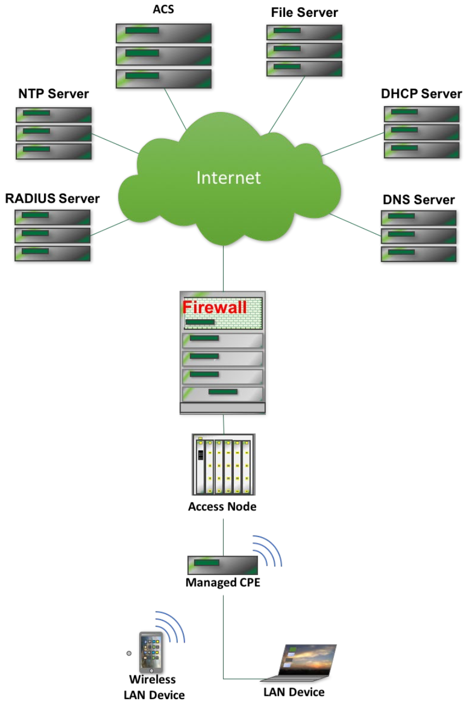

---
# BBF-specific metadata; c.f. Word properties
bbfNumber: TP-181
bbfTitle: CWMP Interoperability and Functionality Test Plan
bbfIssue: Issue
bbfVersion: 1 Amendment 2
bbfMonth: January
bbfYear: 2022
bbfType: Test Plan
bbfStatus:
bbfContrib:

# additional settings
project: CPE WAN Management Protocol (TR-069)
tagline: '%bbfTitle%'
reponame: cwmp-data-model-test

# navigation buttons shown on each page header
buttons:
- label: HTML
  title: '%bbfNumber% Single-file HTML'
  url: index.htm
- label: PDF
  url: index.pdf
  title: '%bbfNumber% PDF'
- label: Data Models
  title: CWMP Data Models
  url: https://cwmp-data-models.broadband-forum.org
- label: TR-069
  url: https://www.broadband-forum.org/technical/download/TR-069.pdf
  title: TR-069 PDF

# div templates
bbfRevisionHistory:

- number: 'Issue 1'
  approval: 25 January 2019
  publication: 25 January 2019
  editors: |
      Tim Winters, UNH-IOL \
      Marion Dillon, UNH-IOL
  changes: |
      Original

- number: '[Issue 1 Corrigendum 1](https://www.broadband-forum.org/technical/download/TP-181_Corrigendum-1.pdf)'
  approval: 22 September 2020
  publication: 22 September 2020
  editors: |
      Jason Walls, QA Cafe
  changes: |
      Clarifications to tests 5.1.8, 5.5.1, 5.5.2, and incorrect parameter name
      (DestinationInterface &rarr; DestInterface)

- number: '[Issue 1 Amendment 2](https://www.broadband-forum.org/technical/download/TP-181_Amendment-2.pdf)'
  approval: 27 January 2022
  publication: 27 January 2022
  editors: |
      Jason Walls, QA Cafe
  changes: |
      Adds WPA3 tests\
      Moves document to web publishing

bbfEditors:
- Jason Walls, QA Cafe, <jason@qacafe.com>

# this shows how to override a div template spec (to add BUS)
bbfWADsSpec:
  title: |
    ### Broadband User Services Work Area Director(s) {.unnumbered .unlisted}

bbfWADs:
- Jason Walls, QA Cafe
- John Blackford, CommScope

# these references assume use of bbf.csl; please follow the existing style
references:

# XXX the latest is i2c1; it doesn't appear to be on the public website
- id: IR-069i2
  call-number: IR-069 Issue 2
  title: TR-069 Conformance Test Plan
  publisher: Broadband Forum
  issued: {year: 2016}

- id: OD-361
  call-number: OD-361
  title: CWMP Certification Program Guidelines
  publisher: Broadband Forum
  issued: {year: 2016}

- id: REC-xml
  call-number: REC-xml
  title: Extensible Markup Language (XML) 1.0 (Fifth Edition)
  publisher: W3C
  issued: {year: 2008}
  URL: https://www.w3.org/TR/xml

- id: TR-181
  call-number: TR-181 Issue 2
  title: Device Data Model
  publisher: Broadband Forum
  URL: https://usp-data-models.broadband-forum.org#Device:2

# end of metadata
...

!include cover-page.md

!include tp-notice.md

!include front-matter.md

# Executive Summary {.unnumbered .unlisted .new-page}

In order to ensure the continued growth of the TR-069 market and further the interoperability of the protocol, the Broadband Forum is creating a TR-069 Certification Program. Within this program, devices implementing a TR-069 management interface may be tested for their conformance to the TR-069 specification and various use cases.  The TR-069 Certification Program started with the TR-069 Conformance Test Plan and now the CWMP Data Model Implementation Test Plan.  To provide a consistent scope for this verification, BBF developed these test plans that are to be used by the testing agencies in the verification process.

This %bbfType% provides a test plan that may be used to verify Interoperability of a CPE Device with an ACS Server through use cases.

# Purpose and Scope {.new-page}

## Purpose

The purpose of this document is to provide a set of use test cases, which will be used as a common testing language during Interoperability testing of a CPE Device with an ACS Server.

## Scope

The tests detailed in this document are only intended to facilitate TR-069 interoperability use case testing. The tests in this document are limited to ACSs and CWMP enabled CPE devices.

## Test Execution

The tests detailed in this document are to be run in a controlled environment. There is no specified order to the tests in this document.

# References and Terminology {.new-page}

## Conventions

In this %bbfType%, several words are used to signify the requirements of the specification. These words are always capitalized. More information can be found be in RFC 2119 [@RFC2119].

|                    |
|--------------------|-------------------------------------------------------------------------------
| **MUST**           | This word, or the terms "REQUIRED", means that the definition is an absolute requirement of the specification.
| **MUST NOT**       | This phrase means that the definition is an absolute prohibition of the specification.
| **SHOULD**         | This word, or the adjective "RECOMMENDED", means that there could exist valid reasons in particular circumstances to ignore this item, but the full implications need to be understood and carefully weighed before choosing a different course.
| **SHOULD NOT**     | This phrase, or the phrase "NOT RECOMMENDED" means that there could exist valid reasons in particular circumstances when the particular behavior is acceptable or even useful, but the full implications need to be understood and the case carefully weighed before implementing any behavior described with this label.
| **MAY**            | This word, or the adjective "OPTIONAL", means that this item is one of an allowed set of alternatives. An implementation that does not include this option MUST be prepared to inter-operate with another implementation that does include the option.

## References

The following references are of relevance to this %bbfType%. At the time of publication, the editions indicated were valid. All references are subject to revision; users of this %bbfType% are therefore encouraged to investigate the possibility of applying the most recent edition of the references listed below, including any released amendments or corrigendum materials.

A list of currently valid Broadband Forum Technical Reports is published at [www.broadband-forum.org](http://www.broadband-forum.org).

::: {#refs}
:::

## Abbreviations

This %bbfType% uses the following abbreviations:

::: borderless
|       |                                                                    |
|-------|--------------------------------------------------------------------|
| ACS   | Auto-Configuration Server                                          |
| CN    | Common Name                                                        |
| CPE   | Customer Premise Equipment                                         |
| CWMP  | CPE WAN Management Protocol                                        |
| DHCP  | Dynamic Host Configuration Protocol                                |
| DNS   | Domain Name System                                                 |
| DSLAM | DSL Access Multiplexer                                             |
| DUT   | Device Under Test                                                  |
| FTP   | File transfer Protocol                                             |
| HTTP  | Hypertext Transfer Protocol                                        |
| HTTPS | Hypertext Transfer Protocol over Secure Socket Layer               |
| ID    | Identifier                                                         |
| IP    | Internet Protocol                                                  |
| IPv6  | Internet Protocol version 6                                        |
| LAN   | Local Area Network                                                 |
| NAT   | Network Address Translation                                        |
| NTP   | Network Time Protocol                                              |
| RFC   | Request for Proposal                                               |
| RPC   | Remote Procedure Call                                              |
| SOAP  | Simple Object Access Protocol                                      |
| SSL   | Secure Socket Layer                                                |
| STB   | Set Top Box                                                        |
| STUN  | Session Traversal Utilities for NAT                                |
| TCP   | Transmission Control Protocol                                      |
| TFTP  | Trivial File transfer Protocol                                     |
| TLS   | Transport Layer Security                                           |
| TR    | Technical Report                                                   |
| TTL   | Time to Live                                                       |
| UDP   | User Datagram Protocol,                                            |
| URL   | Universal Resource Locator                                         |
| URN   | Uniform Resource Name                                              |
| UTC   | Coordinated Universal Time                                         |
| UTF   | Universal Multiple-Octet Coded Character Set Transformation Format |
| UUID  | Universally Unique Identifier                                      |
| VoIP  | Voice over Internet Protocol                                       |
| WAN   | Wide Area Network                                                  |
| XML   | Extensible Markup Language                                         |
| WA    | Work Area                                                          |
:::

# %bbfType% Impact {.new-page}

## Energy Efficiency

%bbfNumber% has no impact on Energy Efficiency.

## IPv6

%bbfNumber% intends to support the IPv6 protocol.  However, in this issue of the Working Text, IPv6 specific test cases have not been identified.

## Security

%bbfNumber% requires the use of authentication when connecting CPE to an ACS.  Use of an HTTPS URL indicates that the CPE can establish an SSL or TLS connection to the ACS.

# Test Setup {.new-page}

## Test Equipment

The necessary set of test equipment to deliver reliable and repeatable test results is specified in @tbl:required-test-equipment.

:Required Test Equipment

| Test Equipment      | Description and Functional Capabilities                                                                                             |
|---------------------|-------------------------------------------------------------------------------------------------------------------------------------|
| ACS                 | The ACS is an interoperability partner in this test plan                                                                           |
| Traffic Analyzer    | To verify certain test metrics, Traffic Analyzers MUST be present between the CPE and ACS and between the CPE and any LAN Device   |
| Access Node         | For infrastructure needs, an Access Node will be provided to bridge connections between the CPE and ACS                            |
| File Server         | The File Server MUST support HTTP PUT & GET, as well as FTP PUT & GET                                                              |
| CPE                 | The CPE is an interoperability partner in this test plan                                                                           |
| Network Router      | There may be one or more Network Routers between the CPE & ACS. If the CPE is a LAN CPE, one Network Router may be configured to provide a Network Address Translation (NAT) function |
| Firewall            | The Firewall MUST support the ability to selectively block traffic based on IP address                                             |
| NTP Server          | Two NTP Servers. Public NTP Servers such as NIST Internet Time Servers may be used                                                 |
| RADIUS Server       | To authenticate end devices in WPA Enterprise test cases                                                                            |
| DHCP Server         | To assign addresses and other provisioning information to the CPE on the WAN                                                        |
| DNS Server          | To resolve addresses on the WAN                                                                                                     |
| LAN Device          | To connect to the LAN side of a Gateway CPE                                                                                        |
| Wireless LAN Device | To connect to the LAN side of a Gateway CPE over wireless                                                                          |

## Test Setup and Execution

The Interoperability test setup is shown below in @fig:common-topology-for-interoperability-testing. The following pieces of test equipment needs to be connected to the Internet and reachable over IP, but there is no other topology requirement: ACS, DHCP Server, DNS Server, File Server, NTP Server, RADIUS Server. The Access Node may not be required if the primary CPE connection is Ethernet.

### Common Test Setup

This section describes the test setup shared between all test cases. Any additional setup steps will be described in the "Test Setup" section of the test case.

#. ACS is connected to the network

#. CPE is connected to the network and configured with an ACS URL that corresponds to the ACS in step 1.

#. Have a Network Analyzer to capture traffic between ACS and CPE.

### Determine WAN Interface

This section describes steps to determine the WAN interface of a device. These steps are referenced in the Test Procedures.

For CPE that support the Device:2 data model:

* The ACS performs a GetParameterNames RPC on the Interface table. The interface with the WAN IP address is the WAN interface.

For CPE that support the InternetGatewayDevice:1 root data model [@TR-098]:

* The ACS performs a GetParameterValues RPC on InternetGatewayDevice.Layer3Forwarding.DefaultConnectionService. This will return the WAN interface.

### Test Execution

Each test is defined as a separate entity that can be run independent of all other test procedures.  These tests, performed sequentially, may cause changes to the ACS & CPE states during the course of testing.

::: note
If a CPE returns a status of 1 in a SetParameterValuesResponse or an AddObjectResponse, the following steps MUST be followed:

#. Terminate the CWMP session.

#. Configure the ACS to issue a connection request.

#. Configure the ACS to issue a GetParameterValues RPC for the changed variable(s) and verify that they are correct.
:::

## CPE Test Requirements and Prerequisites

#. OD-361 section 3.4.4 [@OD-361] states that passing IR-069i2 [@IR-069i2] is a prerequisite for a CPE undergoing this test plan.

#. Each test case includes a References section that refers to a version of a data model definition or other standard document. For all Broadband Forum data models and Broadband Forum Technical Reports, the test case references the earliest version the CPE can support to run the test case.

#. Each test case includes a Profiles section that includes the profiles needed to run the test case. Any additional requirements are included in the Optional Features section. If the CPE supports the profile and the optional feature listed, the test case MUST be run.

    * **Note:** For test cases that require Baseline:1 or Baseline:2 support, the CPE MUST support each parameter listed in the test case, but does not need to support each parameter in the profile.

    * A list of test cases by profile is included below. Note, there may be additional parameters required or required parameter values. Refer to the test case for complete information.

| Device:2 Profile                                 | Applicable Tests
|--------------------------------------------------|--------------------------------------------------
| None                                             | [#][GetRPCMethods]\
[#][Encrypted Connection]
| Baseline:1                                       | [#][Factory Reset]\
[#][Firmware Download]\
[#][Configuration Backup and Restoration]\
[#][SPV on a Boolean Parameter]\
[#][Non-Printable ASCII Characters in SetParameterValues RPC (Device:2 Only)]\
[#][Multi-Byte Encoding in SetParameterValues RPC (Device:2 Only)]\
[#][Non-ASCII Characters in ParameterKey (Device:2 Only)]\
[#][Multi-Byte Encoding in ParameterKey (Device:2 Only)]\
[#][Non-ASCII Characters in CommandKey (Device:2 Only)]\
[#][Multi-Byte Encoding in CommandKey (Device:2 Only)]
| Time:1                                           | [#][Time Setting (Device:2 Only)]
| PPPInterface:1                                   | [#][PPP Interface Change]
| DHCPv4Server:1                                   | [#][DHCP Provisioning]
| Vendor specific parameters                       | [#][GetParameterNames Vendor Specific Parameters]\
[#][SetParameterValues Vendor Specific Parameters]
| IPPing:1 OR IPPingDetailed:1                     | [#][Diagnostics IPPing]
| Download:1                                       | [#][Download Diagnostics over HTTP]\
[#][Download Diagnostics over FTP]
| Upload:1                                         | [#][Upload Diagnostics over HTTP]\
[#][Upload Diagnostics over FTP]
| TraceRoute:1                                     | [#][TraceRoute]
| UDPEcho:1                                        | [#][UDPEcho Test]
| Baseline:2, IPInterface:1, EtherenetInterface:1, WiFiSSID:1, WiFiRadio:1 | [#][Current Interface Configuration (Device:2 Only)]
| Hosts:2                                          | [#][Connected LAN Devices – Wi-Fi (Device:2 Only)]
| Hosts:2, DHCPv4ServerClientInfo:1, DHCPv6ServerClientInfo | [#][Connected LAN Devices – DHCP (Device:2 Only)]
| Hosts:1                                          | [#][Device Connect/Disconnect Notification Test]
| NAT:1                                            | [#][Create a Port Mapping – Single Interface]\
[#][Create a Port Mapping – All Interfaces (Device:2 Only)]\
[#][Create a Port Mapping – External Port Range]\
[#][Create a Port Mapping – Lease Duration > 0]\
[#][Create a Port Mapping – Remote Host Restriction]\
[#][Create a Port Mapping – Multiple Entries – Precedence Rules]\
[#][Modify a Port Mapping]\
[#][Delete a Port Mapping]\
[#][Create a Port Mapping – TCP]
| AdvancedFirewall:1                               | [#][Default Policy (Device:2 Only)]\
[#][Deny/Allow Outbound Protocols (Device:2 Only)]\
[#][Deny/Allow Outbound Ports (Device:2 Only)]\
[#][Deny/Allow Source IP Address (Device:2 Only)]
| WiFiRadio:1, WiFiSSID:1, WiFiAccessPoint:1       | [#][Wi-Fi Setup WEP 64 (Device:2 Only)]\
[#][Wi-Fi Setup WEP 128 (Device:2 Only)]\
[#][Wi-Fi Setup WPA Personal (Device:2 Only)]\
[#][Wi-Fi Setup WPA Enterprise (Device:2 Only)]\
[#][Wi-Fi Setup WPA2 Personal (Device:2 Only)]\
[#][Wi-Fi Setup WPA2 Enterprise (Device:2 Only)]\
[#][Wi-Fi Setup WPA-WPA2 Personal (Device:2 Only)]\
[#][Wi-Fi Setup WPA-WPA2 Enterprise (Device:2 Only)]\
[#][Wi-Fi Setup WPA3 Personal (Device:2 only)]\
[#][Wi-Fi Setup WPA3-Personal-Transition (Device:2 only)]\
[#][Wi-Fi Setup WPA3-Enterprise (Device:2 only)]\
[#][Wi-Fi Setup – Add SSID (Device:2 Only)]\
[#][Wi-Fi Setup – Remove SSID (Device:2 Only)]

| InternetGatewayDevice:1 Profile                  | Applicable Tests
|--------------------------------------------------|--------------------------------------------------
| None                                             | [#][GetRPCMethods]\
[#][Encrypted Connection]
| Baseline:1                                       | [#][Factory Reset]\
[#][Firmware Download]\
[#][Configuration Backup and Restoration]\
[#][SPV on a Boolean Parameter]\
[#][Device Connect/Disconnect Notification Test]\
[#][Create a Port Mapping – Single Interface]\
[#][Create a Port Mapping – External Port Range]\
[#][Create a Port Mapping – Lease Duration > 0]\
[#][Create a Port Mapping – Remote Host Restriction]\
[#][Create a Port Mapping – Multiple Entries – Precedence Rules]\
[#][Modify a Port Mapping]\
[#][Delete a Port Mapping]\
[#][Create a Port Mapping – TCP]
| Time:2                                           | [#][Time Setting (InternetGatewayDevice:1 Only)]
| Baseline:2                                       | [#][PPP Interface Change]\
[#][Connected LAN Devices (InternetGatewayDevice:1 Only)]\
[#][DHCP Provisioning]
| Vendor specific parameters                       | [#][GetParameterNames Vendor Specific Parameters]\
[#][SetParameterValues Vendor Specific Parameters]
| Baseline:1, IPPing:1                             | [#][Diagnostics IPPing]
| Download:1                                       | [#][Download Diagnostics over HTTP]\
[#][Download Diagnostics over FTP]
| Upload:1                                         | [#][Upload Diagnostics over HTTP]\
[#][Upload Diagnostics over FTP]
| TraceRoute:1                                     | [#][TraceRoute]
| UDPEcho:1                                        | [#][UDPEcho Test]
| WiFiLan:1                                        | [#][Wi-Fi Setup WEP 64 (InternetGatewayDevice:1 Only)]\
[#][Wi-Fi Setup WEP 128 (InternetGatewayDevice:1 Only)]\
[#][Wi-Fi Setup WPA Personal (InternetGatewayDevice:1 Only)]\
[#][Wi-Fi Setup WPA2 Personal (InternetGatewayDevice:1 Only)]\
[#][Wi-Fi Setup WPA-WPA2 Personal (InternetGatewayDevice:1 Only)]

## ACS Test Requirements

The ACS MUST be configurable to include an interface that allows control of the ACS to execute the test procedures.
An API SHOULD be provided to the test lab to support automation of this test plan.
The ACS MUST allow its certificates to be configured.

## Interoperability Testing

This test plan tests the ACS/CPE system, therefore a failure may indicate a deficiency from either the ACS or CPE.

## Test Validation

A test is considered successful (or passed) when the corresponding test procedure has been completed and the specified success metrics are attained. Tests can be validated by observing functional changes in the DUTs, through feedback interfaces on the devices under test, results attained from the ACS, and via a Traffic Analyzer connected to the relevant links.

# Test Procedures {.new-page}

## Basic Setup

### Factory Reset

#### Purpose:

| To verify that an ACS can perform a Factory Reset on the CPE.

#### References:

| InternetGatewayDevice:1 [@TR-098]
| Device:2 [@TR-181]

#### Profiles:

| Device:2   | InternetGatewayDevice:1 |
|------------|-------------------------|
| Baseline:1 | Baseline:1              |

#### Optional Features:

| Factory Reset RPC

#### Parameters:

| The following parameter is required to be implemented for this test. CPE supports FactoryReset RPC.

| For CPE that support the Device:2 data model:

| Device.DeviceInfo. |          |
|--------------------|----------|
| ProvisioningCode   | <string> |

For CPE that support the InternetGatewayDevice:1 [@TR-098] data model:

| InternetGatewayDevice.DeviceInfo. |          |
|-----------------------------------|----------|
| ProvisioningCode                  | <string> |

#### Test Setup:

#. Refer to [Common Test Setup] for setup steps.

#### Procedure:

#. ACS performs a GetParameterValues RPC on the above parameter to determine its value.
#. ACS performs a SetParameterValues RPC on the above parameter for a value that is different than the value returned in step 1.
#. ACS performs a FactoryReset RPC to the CPE.
#. Allow the ACS to perform bootstrap procedures on the CPE, if it is configured to do so.
#. ACS performs a GetParameterValues RPC on the above parameter.

#### Test Metrics:

#. Validate that the FactoryReset successfully occurs via FactoryResetResponse and a "0 BOOTSTRAP" Inform RPC is sent by CPE.
#. Validate that the value of the above parameter returned in step 5 is different than it was set to in Procedure step 2.

### Time Setting (Device:2 Only)

#### Purpose:

| To verify that an ACS can set time configuration on the CPE.

#### References:

| Device:2 [@TR-181]

#### Profiles:

| Device:2 | InternetGatewayDevice:1 |
|----------|-------------------------|
| Time:1   | N/A                     |

#### Optional Features:

| None

#### Parameters:

| The following parameters are required to be implemented for this test:

| Device.Time.     |                                                             |
|------------------|-------------------------------------------------------------|
| Enable           | True                                                        |
| Status           | Returned from device                                        |
| NTPServer1       | <IP Address of NTP Server1>                                 |
| NTPServer2       | <IP Address of NTP Server2>                                 |
| CurrentLocalTime | Returned from device                                        |
| LocalTimeZone    | <Local Time Zone definition in  IEEE 1003.1 (POSIX) format> |

#### Test Setup:

#. Refer to [Common Test Setup] for setup steps.
#. Have two NTP servers accessible on the WAN.
#. Have the ability to block data communications to the NTP Servers.

#### Procedure:

#. ACS performs a SetParameterValues RPC on the NTPServer1, NTPServer2, TimeZone, and Enable parameters.
#. Test setup blocks NTPServer2 address.
#. CPE is rebooted.
#. ACS performs a GetParameterValues RPC on the Status and CurrentLocalTime parameters.
#. Test setup blocks NTPServer1 address and unblocks NTPServer2 address
#. CPE is rebooted
#. ACS performs a GetParameterValues RPC on the Status and LocalTime parameters.

#### Test Metrics:

#. Validate that the SetParameterValuesResponse is received successfully for setting both NTPServer1 and NTPServer2.
#. After the reboot, validate that the Traffic Analyzer shows CPE communication with NTPServer1.
#. Validate that the time is set on the CPE via the GetParameterValuesResponse.
#. After the reboot, validate that the Traffic Analyzer shows CPE communication with NTPServer2.
#. Validate that the time is set on the CPE via the GetParameterValuesResponse.

### Time Setting (InternetGatewayDevice:1 Only)

#### Purpose:

| To verify that an ACS can set time configuration on the CPE.

#### References:

| InternetGatewayDevice:1 [@TR-098]

#### Profiles:

| Device:2 | InternetGatewayDevice:1 |
|----------|-------------------------|
| N/A      | Time:1                  |

#### Optional Features:

| None

#### Parameters:

| The following parameters are required to be implemented for this test:

| InternetGatewayDevice.Time. |                             |
|-----------------------------|-----------------------------|
| NTPServer1                  | <IP Address of NTP Server1> |
| NTPServer2                  | <IP Address of NTP Server2> |
| CurrentLocalTime            | Returned from device        |
| LocalTimeZone               | <Time Zone offset>          |

#### Test Setup:

#. Refer to [Common Test Setup] for setup steps.
#. Have two NTP servers accessible on the WAN.
#. Have the ability to block data communications to the NTP Servers.

#### Procedure:

#. ACS performs a SetParameterValues RPC on the NTPServer1, NTPServer2, and TimeZone parameters.
#. Test setup blocks NTPServer2 address.
#. CPE is rebooted.
#. ACS performs a GetParameterValues RPC on the LocalTime parameters.
#. Test setup blocks NTPServer1 address and unblocks NTPServer2 address
#. CPE is rebooted
#. ACS performs a GetParameterValues RPC on the CurrentLocalTime parameter.

#### Test Metrics:

#. Validate that the SetParameterValuesResponse is received successfully for setting both NTPServer1 and NTPServer2.
#. After the reboot, validate that the Traffic Analyzer shows CPE communication with NTPServer1.
#. Validate that the time is set on the CPE via the GetParameterValuesResponse.
#. After the reboot, validate that the Traffic Analyzer shows CPE communication with NTPServer2.
#. Validate that the time is set on the CPE via the GetParameterValuesResponse.

### Firmware Download

#### Purpose:

| To verify that an ACS can perform a firmware download on the CPE.

#### References:

| InternetGatewayDevice:1 [@TR-098]

| Device:2 [@TR-181]

#### Profiles:

| Device:2   | InternetGatewayDevice:1 |
|------------|-------------------------|
| Baseline:1 | Baseline:1              |

#### Optional Features:

| None

#### Parameters:

| The following parameter is required to be implemented by the CPE for this test.

| For CPE that support the Device:2 data model:

| Device.DeviceInfo. |                      |
|--------------------|----------------------|
| SoftwareVersion    | Returned from device |

For CPE that support the InternetGatewayDevice:1 data model:

| InternetGatewayDevice.DeviceInfo. |                      |
|-----------------------------------|----------------------|
| SoftwareVersion                   | Returned from device |

#### Test Setup:

#. Refer to [Common Test Setup] for setup steps.
#. Have a file server accessible on the WAN with known credentials.
#. Place firmware to download on the file server.

#### Procedure:

#. ACS issues a GetParameterValues RPC on the CPE SoftwareVersion parameter listed in the parameters section to learn the CPEs current software version
#. ACS issues a Download RPC to the CPE with the following arguments set

| Download RPC Argument | Value                                    |
|-----------------------|------------------------------------------|
| CommandKey            | <string>                                 |
| FileType              | "1 Firmware Upgrade Image"               |
| URL                   | URL of firmware image on the file server |
| Username              | File server username                     |
| Password              | File server password                     |
| FileSize              | Size of file to download in bytes        |
| TargetFileName        | Name of the firmware to download         |
| DelaySeconds          |                                          |
| SuccessURL            | <empty>                                  |
| FailureURL            | <empty>                                  |

Allow the CPE to complete firmware download from the file server, apply the firmware, and reboot if necessary
After CPE issues a "7 TRANSER COMPLETE" event code, the ACS issues a GetParameterValues RPC on the on the CPE SoftwareVersion parameter listed in the parameters section to learn the CPEs new software version

#### Test Metrics:

#. Ensure the software version reported by the CPE before the firmware download is different than the software version reported by the CPE after the firmware download.

### GetRPCMethods

#### Purpose:

| This test is designed to verify that the ACS can schedule a GetRPCMethods RPC to a CPE and get back the correct response

#### References:

| Section A.3.1.1/TR-069 [@TR-069]

#### Profiles:

| Device:2 | InternetGatewayDevice:1 |
|----------|-------------------------|
| N/A      | N/A                     |

#### Optional Features:

| None

#### Parameters:

| None.

#### Test Setup:

#. Refer to [Common Test Setup] for setup steps.

#### Procedure:

#. ACS schedules a GetRPCMethods RPC on the CPE.
#. Allow the CPE to respond with the GetRPCMethodsResponse

#### Test Metrics:

#. Verify that the CPE responds to the GetRPCMethods RPC
#. Verify that the GetRPCMethodsResponse contains all mandatory RPCs

### Configuration Backup and Restoration

#### Purpose:

| This test is designed to verify that the ACS can schedule an upload of a CPE's configuration and then perform a restoration of that same configuration.

#### References:

| Section A.4.1.5/TR-069a1 or later [@TR-069]

#### Profiles:

| Device:2   | InternetGatewayDevice:1 |
|------------|-------------------------|
| Baseline:1 | Baseline:1              |

#### Optional Features:

| Upload RPC

#### Parameters:

| These arguments are for the Upload and Download RPCs. Note, if the CPE supports Upload FileType "3 Vendor Configuration File <i>", the test case MUST be run using that FileType.

| Upload RPC Argument | Value                                                              |
|---------------------|--------------------------------------------------------------------|
| CommandKey          | <string>                                                           |
| FileType            | "3 Vendor Configuration File <i>" OR "1 Vendor Configuration File" |
| URL                 | URL of firmware image on the file server                           |
| Username            | File server username                                               |
| Password            | File server password                                               |
| DelaySeconds        |                                                                    |

| Download RPC Argument | Value                                        |
|-----------------------|----------------------------------------------|
| CommandKey            | <string>                                     |
| FileType              | "3 Vendor Configuration File"                |
| URL                   | URL of configuration file on the file server |
| Username              | File server username                         |
| Password              | File server password                         |
| FileSize              | Size of file to download in bytes            |
| TargetFileName        | Name of the configuration file to download   |
| DelaySeconds          |                                              |
| SuccessURL            | <empty>                                      |
| FailureURL            | <empty>                                      |

| The following parameter path is required to be implemented for this test.

| For CPE that support the Device:2 data model:

| Device.DeviceInfo.VendorConfigFile. |
|-------------------------------------|

For CPE that support the InternetGatewayDevice:1 data model:

| InternetGatewayDevice. DeviceInfo.VendorConfigFile. |
|-----------------------------------------------------|

#### Test Setup:

#. Refer to [Common Test Setup] for setup steps.
#. Have a file server accessible on the WAN with known credentials that can accept uploads and downloads.
#. If CPE supports "3 Vendor Configuration File <i>" Upload FileType, perform a GetParameterValues RPC  on the partial path above to determine the correct instance number to upload.

#### Procedure:

#. ACS performs a GetParameterValues RPC on PeriodicInformInterval to determine its value.
#. ACS schedules an Upload RPC on the CPE with the parameters above.
#. Allow the upload to complete.
#. ACS performs a SetParameterValues RPC on PeriodicInformInterval for a value that is different than the value returned in step 1.
#. Wait for the CPE to send 2 Periodic Informs and check the interval between them.
#. ACS schedules a download RPC on the CPE with the parameters above.
#. Allow the download to complete.
#. Wait for the CPE to send 2 Periodic Informs and check the interval between them.

#### Test Metrics:

#. Verify that the CPE responds to the Upload RPC with an UploadResponse
#. Verify that the DUT uploaded the configuration to the server
#. Verify that the CPE sends Periodic Informs at the interval set in Step 4.
#. Verify that the CPE responds to the Download RPC with a DownloadResponse
#. Verify that the CPE sends Periodic Informs at the interval returned from the device in Step 1.

### PPP Interface Change

#### Purpose:

| This test is designed to verify that the ACS can configure the PPP interface of the CPE.

#### References:

| InternetGatewayDevice:1.4

| Device:2 [@TR-181]

#### Profiles:

| Device:2       | InternetGatewayDevice:1 |
|----------------|-------------------------|
| PPPInterface:1 | Baseline:2              |

#### Optional Features:

| None

#### Parameters:

| This test is only applicable to CPE that use PPP to obtain an IP address. The following parameters are required to be implemented for this test.

| For CPE that support the Device:2 data model:

| Device.PPP.Interface.{i}. |                      |
|---------------------------|----------------------|
| Username                  | username1, username2 |
| Password                  | password1, password2 |
| Reset                     | true                 |

For CPE that support the InternetGatewayDevice:1 data model:

| InternetGatewayDevice.WANDevice.{i}.WANConnectionDevice.{i}.WANPPPConnection.{i}. |                      |
|-----------------------------------------------------------------------------------|----------------------|
| Username                                                                          | username1, username2 |
| Password                                                                          | password1, password2 |
| Reset                                                                             | true                 |

#### Test Setup:

#. Refer to [Common Test Setup] for setup steps.
#. Setup two valid sets of credentials on the PPP server, username1/password1 and username2/password2

#### Procedure:

#. ACS determines the instance number of the PPP interface.
#. ACS performs a GetParameterValues RPC on the CPE for Username and Password.
#. Allow the CPE to respond with a GetParameterValuesResponse
#. ACS performs a SetParameterValues RPC on the CPE for Username, Password, and Reset, using the second set of valid credentials, username2/password2.
#. Allow the CPE to respond with a SetParameterValuesResponse and establish a new PPP session.
#. ACS performs a GetParameterValues RPC on the CPE for Username and Password.
#. Allow the CPE to respond with a GetParameterValuesResponse.
#. Reboot the device.
#. ACS performs a GetParameterValues RPC on the CPE for Username and Password.

#### Test Metrics:

#. Validate that the CPE sends a GetParameterValuesResponse in step 3 containing Username=username1 and Password=<empty string>.
#. Validate that the CPE sends a SetParameterValuesResponse in step 5 with Status=1 and that the CWMP session is successfully ended.
#. Validate that the CPE successfully establishes a new PPP session using the new credentials.
#. Validate that the CPE sends a GetParameterValuesResponse in step 7 containing Username=username2 and Password=<empty string>.
#. Validate that the CPE sends a GetParameterValuesResponse in step 9 containing Username=username2 and Password=<empty string>.

### DHCP Provisioning

#### Purpose:

| To verify that an ACS can configure the basic DHCPv4 configuration required on a CPE device.

#### References:

| InternetGatewayDevice:1 [@TR-098]

| Device:2 [@TR-181]

| RFC 2131 [@RFC2131]

| RFC 2132 [@RFC2132]

| RFC 3315 [@RFC3315]

#### Profiles:

| Device:2       | InternetGatewayDevice:1 |
|----------------|-------------------------|
| DHCPv4Server:1 | Baseline:2              |

#### Optional Features:

| DHCPLeaseTime is included in data model for CPE that support the InternetGatewayDevice:1 data model.

#### Parameters:

| The following parameters are required to be implemented for this test.

| For CPE that support the Device:2 root data model:

| Device.DHCPv4.Server.Pool.{i}. |                      |
|--------------------------------|----------------------|
| Enable                         | true                 |
| Interface                      | Returned from device |
| MinAddress                     | <minimum address>    |
| MaxAddress                     | <maximum address>    |
| LeaseTime                      | 60                   |

| For CPE that support the InternetGatewayDevice:1 root data model:

| InternetGatewayDevice.LANDevice.{i}.LANHostConfigManagement. |                   |
|--------------------------------------------------------------|-------------------|
| DHCPServerConfigurable                                       | true              |
| DHCPServerEnable                                             | true              |
| MinAddress                                                   | <minimum address> |
| MaxAddress                                                   | <maximum address> |
| DHCPLeaseTime                                                | 60                |

#### Test Setup:

#. Refer to [Common Test Setup] for setup steps.
#. CPE supports the appropriate DHCP parameters in the parameters section
#. Have a LAN device that can connect to the CPE via DHCP.
#. Have a Network Analyzer to capture traffic between the CPE and LAN device.
#. If the DUT implements the Device:2 root data model, determine whether or not an existing entry exists for the object specified above.

#### Procedure:

#. If the DUT implements the Device:2 root data model, and no entry exists for Device.DHCPv4.Server.Pool.{i}., perform an AddObject RPC on Device.Server.Pool., recording the InstanceNumber value returned in the AddObjectResponse.
#. On the ACS schedule a SetParameterValues RPC on the appropriate Configurable parameters in the Parameters Section, setting the DHCP pool's minimum and maximum to be completely outside the existing range, if any (for example, by setting the new minimum above the current maximum).
#. Allow the end system to connect to the CPE via DHCP.
#. Perform a reboot of the CPE
#. Allow the end system to connect to the CPE via DHCP

#### Test Metrics:

#. Verify that the SetParameterValuesResponse RPC is correct for all parameters
#. Verify that the end system connects to the CPE within the designated range.
#. Verify that that end system connects to the CPE within the designated range after the reboot

### SPV on a Boolean Parameter

#### Purpose:

| This is a test case to verify that the ACS can change the Boolean on a CPE and receive the correct response.

#### References:

| Section A.3.2.1/TR-069a1 or later [@TR-069]

#### Profiles:

| Device:2   | InternetGatewayDevice:1 |
|------------|-------------------------|
| Baseline:1 | Baseline:1              |

#### Optional Features:

| None

#### Parameters:

| Writable boolean parameter from the device's data model.

#### Test Setup:

#. Refer to [Common Test Setup] for setup steps.

#### Procedure:

#. ACS establishes a session
#. ACS performs a GetParameterValues RPC on the CPE on a Boolean parameter.
#. ACS schedules a SetParameterValues RPC on the CPE, to change the Boolean parameter to the opposite of the value returned in step #2.
#. Allow the CPE to respond with the SetParameterValuesResponse.
#. ACS schedules a GetParameterValues RPC on the CPE, to request the Boolean parameter.
#. Allow the CPE to respond with the GetParameterValuesResponse

#### Test Metrics:

#. Verify that the CPE responds to the SetParameterValues RPC
#. Verify that the SetParameterValuesResponse contains status 0.
#. Verify that the GetParameterValuesResponse contains the changed value.

### Encrypted Connection

#### Purpose:

| To verify that an ACS and CPE can interoperate using Encryption protocols.

#### References:

| Section 3.3/TR-069a1 [@TR-069]

#### Profiles:

| Device:2 | InternetGatewayDevice:1 |
|----------|-------------------------|
| N/A      | N/A                     |

#### Optional Features:

| Secure CWMP

#### Parameters:

| Readable Parameter from the device's data model.

#### Test Setup:

#. Load the appropriate Certificate of Authentication onto the CPE.
#. Have the private portion of the certificate on the ACS.
#. Refer to [Common Test Setup] for setup steps.

#### Procedure:

#. Allow the CPE to establish an encrypted CWMP session with the ACS.
#. On the ACS schedule a GetParametersValues RPC on the CPE.
#. Allow the CPE to respond with the GetParametersValuesResponse containing the requested parameters.

#### Test Metrics:

#. Verify that the CWMP session is encrypted.
#. Verify that the GetParameterValuesResponse is valid.

### GetParameterNames Vendor Specific Parameters

#### Purpose:

| To verify that vendor specific CPE objects and parameters can be read and processed in an ACS.

#### References:

| Vendor supplied vendor-specific parameters

#### Profiles:

| Device:2                   | InternetGatewayDevice:1    |
|----------------------------|----------------------------|
| Vendor specific parameters | Vendor specific parameters |

#### Optional Features:

| None

#### Parameters:

| Vendor supplied vendor specific parameter, type, and purpose. Vendor supplied vendor specific object and purpose.

#### Test Setup:

#. Refer to [Common Test Setup] for setup steps.
#. Obtain a list of vendor specific parameters from the vendor

#### Procedure:

#. Allow the CPE to establish an CWMP session with the ACS
#. Schedule a GetParameterNames RPC on the CPE entire data model.

#### Test Metrics:

#. Verify that the ACS can process all vendor specific parameters and objects.

### SetParameterValues Vendor Specific Parameters

#### Purpose:

| To verify that vendor specific CPE parameter can be written by an ACS.

#### References:

| Vendor supplied technical survey containing vendor specific information.

#### Profiles:

| Device:2                   | InternetGatewayDevice:1    |
|----------------------------|----------------------------|
| Vendor specific parameters | Vendor specific parameters |

#### Optional Features:

| None

#### Parameters:

| Vendor supplied vendor-specific parameter, type, and purpose.

#### Test Setup:

Refer to [Common Test Setup] for setup steps.
Obtain a writable vendor specific parameter, parameter type, and parameter purpose from the vendor.

#### Procedure:

#. ACS performs a GetParameterValues RPC on the parameter in Test Setup #3.
#. ACS performs a SetParameterValues RPC on the parameter in Test Setup #3 for a value that is different than the value returned in Step 1.
#. ACS performs a GetParameterValues RPC on the parameter in Test Setup #3.
#. Reboot the device.
#. ACS performs a GetParameterValues RPC on the parameter in Test Setup #3.

#### Test Metrics:

#. Verify that the SetParameterValues RPC in Step 2 completes and the CPE responds with a correct SetParameterValuesResponse RPC.
#. Verify that the GetParametersValues RPC in Step 3 completes and the CPE responds with a correct GetParameterValuesResponse RPC.
#. Verify that the value in the GetParameterValues in Step 3 matches the value set in Step 2.
#. Verify that the value in the GetParameterValues in Step 5 matches the value set in Step 2.

## Diagnostics

### Diagnostics IPPing

#### Purpose:

| To verify that an ACS can perform an IP Ping Diagnostics test on the CPE.

#### References:

| InternetGatewayDevice:1 [@TR-098]

| Device:2 [@TR-181]

#### Profiles:

| Device:2                     | InternetGatewayDevice:1 |
|------------------------------|-------------------------|
| IPPing:1 OR IPPingDetailed:1 | IPPing:1, Baseline:1    |

#### Optional Features:

| None

#### Parameters:

| The following parameters are required to be implemented for this test.

| For CPE that implement the Device:2 root data model:

| Device.IP.Diagnostics.IPPing. |                      |
|-------------------------------|----------------------|
| DiagnosticsState              | Requested            |
| Interface                     | Returned from device |
| Host                          | <IP address>         |
| NumberOfRepetitions           |                      |
| Timeout                       | 1000                 |
| DataBlockSize                 | 128                  |
| DSCP                          |                      |
| SuccessCount                  | Returned from device |
| FailureCount                  | Returned from device |
| Device.IP.Interface.          | Device.IP.Interface. |

| For CPE that implement the InternetGatewayDevice:1 root data model:

| InternetGatewayDevice.IPPingDiagnostics.        |                                                 |
|-------------------------------------------------|-------------------------------------------------|
| DiagnosticsState                                | Requested                                       |
| Interface                                       | Returned from device                            |
| Host                                            | <IP address>                                    |
| NumberOfRepetitions                             |                                                 |
| Timeout                                         | 1000                                            |
| DataBlockSize                                   | 128                                             |
| DSCP                                            |                                                 |
| SuccessCount                                    | Returned from device                            |
| FailureCount                                    | Returned from device                            |

| InternetGatewayDevice.Layer3Forwarding.DefaultConnectionService |                      |
|-------------------------------------------------|----------------------|
| DefaultConnectionService                       | Returned from device |

#### Test Setup:

#. Refer to [Common Test Setup] for setup steps.
#. Have a host on the WAN network that can answer pings.
#. Refer to [Determine WAN Interface] to determine the WAN interface. This will be used for the Interface parameter.

#### Procedure:

#. ACS performs a SetParameterValues RPC on the ping diagnostics parameters in the parameter section above.
#. ACS performs a GetParameterValues on the InternetGatewayDevice.IPPingDiagnostics or Device.IP.Diagnostics.IPPing to determine results of ping test

#### Test Metrics:

#. Verify that the CPE transmitted 3 ICMP Echo Requests to the target Host.
#. Validate that the CPE sends an Inform RPC to the ACS with Event Code "8 DIAGNOSTICS COMPLETE".
#. Validate that the DiagnosticsState is set to "Complete".
#. Verify that the SuccessCount and FailureCount match what is seen on the network capture.

### Download Diagnostics over HTTP

#### Purpose:

| To verify that an ACS and CPE can interoperate while performing the download diagnostics function over HTTP. This test will be run if supported on the CPE.

#### References:

| InternetGatewayDevice.1.3

| Device:2 [@TR-181]

#### Profiles:

| Device:2   | InternetGatewayDevice:1 |
|------------|-------------------------|
| Download:1 | Download:1              |

#### Optional Features:

| None

#### Parameters:

| The following parameters are required to be implemented for this test:

| For CPE that implement the Device:2 root data model:

| Device.IP.Diagnostics.DownloadDiagnostics. |                              |
|--------------------------------------------|------------------------------|
| DiagnosticsState                           | Requested                    |
| Interface                                  | Returned from device         |
| DownloadURL                                | <URL of file on HTTP server> |
| TestBytesReceived                          | Returned from device         |
| TotalBytesReceived                         | Returned from device         |
| DownloadTransports                         | Returned from device         |

| For CPE that implement the InternetGatewayDevice:1 root data model:

| InternetGatewayDevice.DownloadDiagnostics. |                              |
|--------------------------------------------|------------------------------|
| DiagnosticsState                           | Requested                    |
| Interface                                  | Returned from device         |
| DownloadURL                                | <URL of file on HTTP server> |
| TestBytesReceived                          | Returned from device         |
| TotalBytesReceived                         | Returned from device         |
|                                            |                              |

| InternetGatewayDevice.Capabilities.PerformanceDiagnostics. |                      |
|------------------------------------------------------------|----------------------|
| DownloadTransports                                         | Returned from device |

| The DownloadTransports parameter MUST include HTTP for this test to be executed.

#### Test Setup:

#. Refer to [Common Test Setup] for setup steps.
#. Have an HTTP server and file to perform the download. The file should be big enough for the file transfer to last at least 30 seconds.

#### Procedure:

#. On the ACS schedule a SetParameterValues RPC on the Interface, DownloadURL and DiagnosticsState parameters listed in the parameters section.
#. Allow the CPE to perform the specific diagnostic tests and send an Inform message with an event code of "8 DIAGNOSTICS COMPLETE".
#.  On the ACS schedule a GetParameterValues RPC on the DownloadDiagnostics object.
#. Perform a reboot of the CPE.
#. On the ACS schedule a GetParameterValues RPC on the DownloadDiagnostics object.

#### Test Metrics:

#. Verify that the SetParameterValuesResponse RPC is correct
#. Verify that an Inform message is received with an event code of "8 DIAGNOSTICS COMPLETE"
#. Verify that the GetParameterValuesResponse contains a valid value for the DiagnosticsState parameter.
#. Verify that TestBytesReceived is correct.
#. Verify that EOMTime – BOMTime is within 1 second of the time that the file server reports the transfer took.
#. Verify that the GetParameterValuesResponse contains a valid value for the DiagnosticsState parameter.
    #. If the value is "Completed" verify that the values in the DownloadDiagnostic object are the same as they were before the reboot.
    #. Verify that TotalBytesReceived is within 1% of the measured traffic.

### Download Diagnostics over FTP

#### Purpose:

| To verify that an ACS and CPE can inter-operate while performing the download diagnostics function over FTP. This test will be run if supported on the CPE.

#### References:

| InternetGatewayDevice.1.3

| Device:2 [@TR-181]

#### Profiles:

| Device:2   | InternetGatewayDevice:1 |
|------------|-------------------------|
| Download:1 | Download:1              |

#### Optional Features:

| DownloadTransports includes FTP

#### Parameters:

| The following parameters are required to be implemented for this test:

| For CPE that implement the Device:2 root data model:

| Device.IP.Diagnostics.DownloadDiagnostics. |                             |
|--------------------------------------------|-----------------------------|
| DiagnosticsState                           | Requested                   |
| Interface                                  | Returned from device        |
| DownloadURL                                | <URL of file on FTP server> |
| TestBytesReceived                          | Returned from device        |
| DownloadTransports                         | Returned from device        |
|                                            |                             |

| For CPE that implement the InternetGatewayDevice:1 root data model:

| InternetGatewayDevice.DownloadDiagnostics. |                             |
|--------------------------------------------|-----------------------------|
| DiagnosticsState                           | Requested                   |
| Interface                                  | Returned from device        |
| DownloadURL                                | <URL of file on FTP server> |
| TestBytesReceived                          | Returned from device        |
| TotalBytesReceived                         | Returned from device        |

| InternetGatewayDevice.Capabilities.PerformanceDiagnostics. |                      |
|------------------------------------------------------------|----------------------|
| DownloadTransports                                         | Returned from device |

| The DownloadTransports parameter MUST include FTP for this test to be executed.

#### Test Setup:

#. Refer to [Common Test Setup] for setup steps.
#. Have an FTP server and file to perform the download. The file should be big enough for the file transfer to last at least 30 seconds.

#### Procedure:

#. On the ACS schedule a SetParameterValues RPC on the Interface, DownloadURL and DiagnosticsState parameters listed in the parameters section.
#. Allow the CPE to perform the specific diagnostic tests and send an Inform message with an event code of "8 DIAGNOSTICS COMPLETE".
#.  On the ACS schedule a GetParameterValues RPC on the DownloadDiagnostics object.
#. Perform a reboot of the CPE.
#. On the ACS schedule a GetParameterValues RPC on the DownloadDiagnostics object.

#### Test Metrics:

#. Verify that the SetParameterValuesResponse RPC is correct
#. Verify that an Inform message is received with an event code of "8 DIAGNOSTICS COMPLETE"
#. Verify that the GetParameterValuesResponse contains a valid value for the DiagnosticsState parameter.
#. Verify that TestBytesReceived is correct.
#. Verify that EOMTime – BOMTime is within 1 second of the time that the file server reports the transfer took.
#. Verify that the GetParameterValuesResponse contains a valid value for the DiagnosticsState parameter.
    #. If the value is "Completed" verify that the values in the DownloadDiagnostic object are the same as they were before the reboot.

### Upload Diagnostics over HTTP {.new-page}

#### Purpose:

| To verify that an ACS and CPE can inter-operate while performing the upload diagnostics function over HTTP. This test will be run if supported on the CPE.

#### References:

| InternetGatewayDevice.1.3

| Device:2 [@TR-181]

#### Profiles:

| Device:2 | InternetGatewayDevice:1 |
|----------|-------------------------|
| Upload:1 | Upload:1                |

#### Optional Features:

| None

#### Parameters:

| The following parameters are required to be implemented for this test:

| For CPE that implement the Device:2 root data model:

| Device.IP.Diagnostics.UploadDiagnostics. |                                                       |
|------------------------------------------|-------------------------------------------------------|
| DiagnosticsState                         | Requested                                             |
| Interface                                | Returned from device                                  |
| UploadURL                                | <URL of HTTP server>                                  |
| TestFileLength                           | <value long enough for the upload to last 30 seconds> |
| TotalBytesSent                           | Returned from device                                  |
| UploadTransports                         | Returned from device                                  |

| For CPE that implement the InternetGatewayDevice:1 root data model:

| InternetGatewayDevice.UploadDiagnostics. |                                                       |
|------------------------------------------|-------------------------------------------------------|
| DiagnosticsState                         | Requested                                             |
| Interface                                | Returned from device                                  |
| UploadURL                                | <URL of HTTP server>                                  |
| TestFileLength                           | <value long enough for the upload to last 30 seconds> |
| TotalBytesSent                           | Returned from device                                  |

| InternetGatewayDevice.Capabilities.PerformanceDiagnostics. |                      |
|------------------------------------------------------------|----------------------|
| UploadTransports                                           | Returned from device |

| The UploadTransports parameter MUST include HTTP for this test to be executed.

#### Test Setup:

#. Refer to [Common Test Setup] for setup steps.
#. Have an HTTP server to perform the Upload.
#. Wireshark running between ACS and CPE.

#### Procedure:

#. On the ACS schedule a SetParameterValues RPC on the Interface, UploadURL and DiagnosticsState parameters listed in the parameters section.
#. Allow the CPE to perform the specific diagnostic tests and send an Inform message with an event code of "8 DIAGNOSTICS COMPLETE".
#. On the ACS schedule a GetParameterValues RPC on the UploadDiagnostics object.
#. Perform a reboot of the CPE
#. On the ACS schedule a GetParameterValues RPC on the UploadDiagnostics object.

#### Test Metrics:

#. Verify that the SetParameterValuesResponse RPC is correct
#. Verify that an Inform message is received with an event code of "8 DIAGNOSTICS COMPLETE"
#. Verify that the GetParameterValuesResponse contains a valid value for the DiagnosticsState parameter.
#. Verify that the test server received a file of TestLengthBytes size.
#. Verify that EOMTime – BOMTime is within 1 second of the time that the file server reports the transfer took.
#. Verify that the GetParameterValuesResponse contains a valid value for the DiagnosticsState parameter.
    #. If the value is "Completed" verify that the values in the UploadDiagnostic object are the same as they were before the reboot.
    #. Verify that TotalBytesSent is within 1% of the measured traffic.

### Upload Diagnostics over FTP

#### Purpose:

| To verify that an ACS and CPE can inter-operate while performing the upload diagnostics function over FTP. This test will be run if supported on the CPE.

#### References:

| InternetGatewayDevice.1.3

| Device:2 [@TR-181]

#### Profiles:

| Device:2 | InternetGatewayDevice:1 |
|----------|-------------------------|
| Upload:1 | Upload:1                |

#### Optional Features:

| UploadTransports includes FTP

#### Parameters:

| The following parameters within the InternetGatewayDevice.UploadDiagnostics table (for devices that implement the InternetGatewayDevice:1 root data model) and Device.IP.Diagnostics.UpLoadDiagnostics table (for devices that implement the Device:2 root data model) are required to be implemented for this test:

| For CPE that implement the Device:2 root data model:

| Device.IP.Diagnostics.UploadDiagnostics. |                                                       |
|------------------------------------------|-------------------------------------------------------|
| DiagnosticsState                         | Requested                                             |
| Interface                                | Returned from device                                  |
| UploadURL                                | <URL of FTP server>                                   |
| TestFileLength                           | <value long enough for the upload to last 30 seconds> |
| UploadTransports                         | Returned from device                                  |

| For CPE that implement the InternetGatewayDevice:1 root data model:

| InternetGatewayDevice.UploadDiagnostics. |                                                       |
|------------------------------------------|-------------------------------------------------------|
| DiagnosticsState                         | Requested                                             |
| Interface                                | Returned from device                                  |
| UploadURL                                | <URL of FTP server>                                   |
| TestFileLength                           | <value long enough for the upload to last 30 seconds> |

| InternetGatewayDevice.Capabilities.PerformanceDiagnostics. |                      |
|------------------------------------------------------------|----------------------|
| UploadTransports                                           | Returned from device |

| The UploadTransports parameter MUST include FTP for this test to be executed.

#### Test Setup:

#. Refer to [Common Test Setup] for setup steps.
#. Have an FTP server to perform the Upload.

#### Procedure:

#. On the ACS schedule a SetParameterValues RPC on the Interface, UploadURL and DiagnosticsState parameters listed in the parameters section.
#. Allow the CPE to perform the specific diagnostic tests and send an Inform message with an event code of "8 DIAGNOSTICS COMPLETE".
#. On the ACS schedule a GetParameterValues RPC on the UploadDiagnostics object.
#. Perform a reboot of the CPE
#. On the ACS schedule a GetParameterValues RPC on the UploadDiagnostics object.

#### Test Metrics:

#. Verify that the SetParameterValuesResponse RPC is correct
#. Verify that an Inform message is received with an event code of "8 DIAGNOSTICS COMPLETE"
#. Verify that the GetParameterValuesResponse contains a valid value for the DiagnosticsState parameter.
#. Verify that the test server received a file of TestLengthBytes size.
#. Verify that EOMTime – BOMTime is within 1 second of the time that the file server reports the transfer took.
#. Verify that the GetParameterValuesResponse contains a valid value for the DiagnosticsState parameter.
    #. If the value is "Completed" verify that the values in the UploadDiagnostic object are the same as they were before the reboot.

### TraceRoute

#### Purpose:

| This test is designed to validate that the CPE supports TraceRoute diagnostics test and reports results appropriately to the ACS.

#### References:

| InternetGatewayDevice:1.4

| Device:2 [@TR-181]

#### Profiles:

| Device:2     | InternetGatewayDevice:1 |
|--------------|-------------------------|
| TraceRoute:1 | TraceRoute:1            |

#### Optional Features:

| None

#### Parameters:

| The following parameters are required to be implemented for this test:

| For CPE that implement the Device:2 root data model:

| Device.IP.Diagnostics.TraceRoute.           |
|---------------------------------------------|---------------------------------------------|
| DiagnosticsState                            | Requested                                   |
| Interface                                   | Returned from device                        |
| Host                                        | <IP address>                                |
| NumberOfTries                               |                                             |
| Timeout                                     | 5000                                        |
| DataBlockSize                               | 128                                         |
| DSCP                                        |                                             |
| MaxHopCount                                 | 30                                          |

| Device.IP.Interface. |   |
|----------------------|---|

| Device.IP.Diagnostics.TraceRoute.RouteHops. |   |
|---------------------------------------------|---|

| For CPE that implement the InternetGatewayDevice:1 root data model:

| InternetGatewayDevice.TraceRouteDiagnostics. |                      |
|----------------------------------------------|----------------------|
| DiagnosticsState                             | Requested            |
| Interface                                    | Returned from device |
| Host                                         | <IP address>         |
| NumberOfTries                                |                      |
| Timeout                                      | 5000                 |
| DataBlockSize                                | 128                  |
| DSCP                                         |                      |
| MaxHopCount                                  | 30                   |

| InternetGatewayDevice.Layer3Forwarding.DefaultConnectionService |                      |
|-------------------------------------------------|----------------------|
| DefaultConnectionService                       | Returned from device |

| InternetGatewayDevice.TraceRouteDiagnostics.RouteHops. |   |
|--------------------------------------------------------|---|

#### Test Setup:

#. Refer to [Common Test Setup] for setup steps.
#. Have a host on the WAN network that can answer the CPE's traceroute mechanism.

#### Procedure:

#. Establish a CWMP session between the CWMP Analyzer and DUT with successful Inform exchanges.
#. Schedule a GetParameterValues RPC on the current WAN interface.
#. Schedule a SetParameterValues RPC on the DUT on the trace route diagnostic parameters listed above.
#. Schedule a GetParameterValues RPC on the DUT on Diagnostic State.
#. Schedule a GetParameterValues RPC on the CPE on the RouteHops table.

#### Test Metrics:

#. The DUT can properly respond to the GetParameterValues request on WAN interface.
#. The DUT is able to properly respond to the SetParameterValues for diagnostics parameter.
#. Verify that the CPE performed the TraceRoute test on the target Host.
#. Validate that the CPE sends an Inform RPC to the ACS with Event Code "8 DIAGNOSTICS COMPLETE".
#. Validate that the DiagnosticsState is set to "Complete".
#. Validate that the Entries in the RouteHops table match the traceroute traffic on the WAN.

### UDPEcho Test

#### Purpose:

| This test is designed to verify that the ACS can configure the UDPEcho service on the CPE and that the CPE implements that service correctly.

#### References:

| InternetGatewayDevice:1.3

| Device:2 [@TR-181]

#### Profiles:

| Device:2  | InternetGatewayDevice:1 |
|-----------|-------------------------|
| UDPEcho:1 | UDPEcho:1               |

#### Optional Features:

| None

#### Parameters:

| The following parameters are required to be implemented for this test:

| For CPE that implement the Device:2 root data model:

| Device.IP.Diagnostics.UDPEchoConfig |                            |
|-------------------------------------|----------------------------|
| Enable                              | <boolean>                  |
| Interface                           | <empty string>             |
| SourceIPAddress                     | <IP Address of UDP Client> |
| UDPPort                             | <port>                     |
| PacketsReceived                     | Returned from device       |
| PacketsResponded                    | Returned from device       |

| For CPE that implement the InternetGatewayDevice:1 root data model:

| InternetGatewayDevice.UDPEchoConfig. |                            |
|--------------------------------------|----------------------------|
| Enable                               | <boolean>                  |
| Interface                            | <empty string>             |
| SourceIPAddress                      | <IP Address of UDP Client> |
| UDPPort                              | <port>                     |
| PacketsReceived                      | Returned from device       |
| PacketsResponded                     | Returned from device       |

#### Test Setup:

#. Refer to [Common Test Setup] for setup steps.
#. UDP client available at source to send UDPEcho packets

#### Procedure:

#. ACS schedules a SetParameterValues RPC on the CPE, setting Enable to false.
#. Allow the CPE to respond with the SetParameterValuesResponse
#. Orderly terminate the session
#. Use the UDP client at source to send n UDP Echo packets to the CPE
#. ACS schedules a SetParameterValues RPC on the CPE, setting the SourceIPAddress and UDPPort that will be used, and setting Enable to true.
#. Allow the CPE to respond with the SetParameterValuesResponse
#. ACS schedules a GetParameterValues RPC on the CPE, reading PacketsReceived and PacketsResponded.
#. Allow the CPE to respond with the GetParameterValuesResponse
#. Orderly terminate the session
#. Use the UDP client at source to send n UDP Echo packets to the CPE
#. ACS schedules a GetParameterValues RPC on the CPE, reading PacketsReceived and PacketsResponded.
#. Allow the CPE to respond with the GetParameterValuesResponse

#### Test Metrics:

#. CPE responds correctly to the various RPCs
#. During step 4, the UPD client receives no response packet
#. During step 7, the counters read have a value of zero
#. During step 10, the UPD client receives n response packets (no loss expected in the closed test network)
#. During step 12, PacketsReceived and PacketsResponded are both n.

## Statistics and Monitoring

### Current Interface Configuration (Device:2 Only)

#### Purpose:

| This test is designed to verify that the ACS can determine the current configuration of the interfaces on the CPE.

#### References:

| Section 4/TR-181i2

#### Profiles:

| Device:2                                                                 | InternetGatewayDevice:1 |
|--------------------------------------------------------------------------|-------------------------|
| Baseline:2, IPInterface:1, EtherenetInterface:1, WiFiSSID:1, WiFiRadio:1 | N/A                     |

#### Optional Features:

| None

#### Parameters:

| The following parameters are required to be implemented for this test:

| Device.InterfaceStack. |   |
|------------------------|---|

| Device.IP.Interface.{i}. |                      |
|--------------------------|----------------------|
| Enable                   | Returned from device |
| LowerLayers              | Returned from device |

| Device.IP.Interface.{i}.IPv4Address.{i}. |                      |
|------------------------------------------|----------------------|
| IPAddress                                | Returned from device |
| SubnetMask                               | Returned from device |

| Device.Ethernet.Interface.{i}. |                      |
|--------------------------------|----------------------|
| Enable                         | Returned from device |
| MACAddress                     | Returned from device |

| Device.Ethernet.Link.{i}. |                      |
|---------------------------|----------------------|
| Enable                    | Returned from device |
| MACAddress                | Returned from device |
| LowerLayers               | Returned from device |

| Device.WiFi.SSID.{i}. |                      |
|-----------------------|----------------------|
| Enable                | Returned from device |
| MACAddress            | Returned from device |
| LowerLayers           | Returned from device |

| Device.WiFi.Radio.{i}. |                      |
|------------------------|----------------------|
| Enable                 | Returned from device |
| Name                   | Returned from device |

#### Test Setup:

#. Refer to [Common Test Setup] for setup steps.

#### Procedure:

#. On the ACS schedule a GetParameterValues RPC for the InterfaceStack on the CPE.
#. Allow the CPE to respond with a GetParameterValuesResponse
#. On the ACS schedule a GetParameterValues on each interface returned in the InterfaceStack.

#### Test Metrics:

#. Verify that the CPE responds to the GetParameterValues RPC.
#. Verify that the InterfaceStack table refers to objects that exist.
#. Verify that each entry in the InterfaceStack table corresponds to the correct LowerLayer.
#. Verify Enable, IPAddress and SubnetMask or MACAddress from all Interface objects.

### Connected LAN Devices (InternetGatewayDevice:1 Only)

#### Purpose:

| This test is designed to verify that the ACS can determine the current connected LAN devices on the CPE and get back the correct response

#### References:

| InternetGatewayDevice:1.4

#### Profiles:

| Device:2 | InternetGatewayDevice:1 |
|----------|-------------------------|
| N/A      | Baseline:2              |

#### Optional Features:

| None

#### Parameters:

| The following parameters are required to be implemented for this test:

| InternetGatewayDevice.LANDevice.{i}.Hosts.Host.{i}. |                      |
|-----------------------------------------------------|----------------------|
| IPAddress                                           | Returned from device |
| AddressSource                                       | Returned from device |
| LeaseTimeRemaining                                  | Returned from device |
| MACAddress                                          | Returned from device |
| Layer2Interface                                     | Returned from device |
| HostName                                            | Returned from device |
| InterfaceType                                       | Returned from device |
| Active                                              | Returned from device |

#### Test Setup:

#. Refer to [Common Test Setup] for setup steps.
#. Have one LAN device connected on each interface that the CPE supports.
#. Have a Network Analyzer to capture traffic between the CPE and each LAN device.

#### Procedure:

#. Connect each LAN device so it is configured with an address.
#. On the ACS schedule a GetParameterValues RPC for InternetGatewayDevice.LANDevice. on the CPE.
#. Allow the CPE to respond with the GetParameterValues

#### Test Metrics:

#. Verify that the CPE responds to the GetParameterValues RPC
#. Verify that the Layer2Interface parameter matches the InterfaceType parameter.
#. Verify that the values of the above parameters returned match each LAN device connected to the CPE.
#. Verify that the Active parameter is set to "true".

### Connected LAN Devices – Wi-Fi (Device:2 Only)

#### Purpose:

| This test is designed to verify that the ACS can determine the current connected LAN devices on the CPE and get back the correct response

#### References:

| Device:2.2

#### Profiles:

| Device:2 | InternetGatewayDevice:1 |
|----------|-------------------------|
| Hosts:2  | N/A                     |

#### Optional Features:

| None

#### Parameters:

| The following parameters are required to be implemented for this test:

| For CPE that implement the Device:2 root data model:

| Device.Hosts.Host.{i}. |                      |
|------------------------|----------------------|
| PhysAddress            | Returned from device |
| AssociatedDevice       | Returned from device |
| Layer1Interface        | Returned from device |
| Layer3Interface        | Returned from device |
| HostName               | Returned from device |
| Active                 | Returned from device |

| Device.Hosts.Host.{i}.IPv4Address.{i}. |                      |
|----------------------------------------|----------------------|
| IPAddress                              | Returned from device |

| Device.Hosts.Host.{i}.IPv6Address.{i}. |                      |
|----------------------------------------|----------------------|
| IPAddress                              | Returned from device |

| Device.WiFi.AccessPoint.{i}.AssociatedDevice.{i}. |                      |
|---------------------------------------------------|----------------------|
| MACAddress                                        | Returned from device |
| SignalStrength                                    | Returned from device |
| Retransmissions                                   | Returned from device |

| Other AssociatedDevice tables if implemented

#### Test Setup:

#. Refer to [Common Test Setup] for setup steps.
#. Have one LAN device connected on the Wi-Fi interface of the CPE.
#. Have a Network Analyzer to capture traffic between the CPE and the LAN device.

#### Procedure:

#. Connect the LAN device so it is configured with an address.
#. On the ACS schedule a GetParameterValues RPC for Device.Hosts. on the CPE.
#. Allow the CPE to respond
#. On the ACS schedule a GetParameterValues RPC for the AssociatedDevice returned.
#. Allow the CPE to respond

#### Test Metrics:

#. Verify that the CPE responds to the GetParameterValues RPC
#. Verify that the values of the above parameters returned match the LAN device
#. Verify that the Active parameter is set to "true"
#. Verify that the value of SignalStrength is within the valid range
#. Verify that the value of Retransmissions is within the valid range

### Connected LAN Devices – DHCP (Device:2 Only)

#### Purpose:

| This test is designed to verify that the ACS can determine the current connected LAN devices on the CPE and get back the correct response

#### References:

| Device:2.2 [@TR-181]

| RFC 2131 [@RFC2131]

| RFC 2132 [@RFC2132]

| RFC 3315 [@RFC3315]

#### Profiles:

| Device:2                                                    | InternetGatewayDevice:1 |
|-------------------------------------------------------------|-------------------------|
| Hosts:2, DHCPv4ServerClientInfo:1, DHCPv6ServerClientInfo:1 | N/A                     |

#### Optional Features:

| None

#### Parameters:

| The following parameters are required to be implemented for this test:

| For CPE that implement the Device:2 root data model:

| Device.Hosts.Host.{i}. |                      |
|------------------------|----------------------|
| PhysAddress            | Returned from device |
| DHCPClient             | Returned from device |
| AssociatedDevice       | Returned from device |
| Layer1Interface        | Returned from device |
| Layer3Interface        | Returned from device |
| HostName               | Returned from device |
| Active                 | Returned from device |

| Device.Hosts.Host.{i}.IPv4Address.{i}. |                      |
|----------------------------------------|----------------------|
| IPAddress                              | Returned from device |

| Device.Hosts.Host.{i}.IPv6Address.{i}. |                      |
|----------------------------------------|----------------------|
| IPAddress                              | Returned from device |

| Device.WiFi.AccessPoint.{i}.AssociatedDevice.{i}. |                      |
|---------------------------------------------------|----------------------|
| SignalStrength                                    | Returned from device |
| Retransmissions                                   | Returned from device |

| Device.DHCPv4.Server.Pool.{i}.Client.{i}.IPv4Address.{i}. |
|-----------------------------------------------------------|-----------------------------------------------------------|
| LeaseTimeRemaining                                        | Returned from device                                      |

| Device.DHCPv4.Server.Pool.{i}.Client.{i}.Option.{i}. |                      |
|------------------------------------------------------|----------------------|
| Tag                                                  | Returned from device |
| Value                                                | Returned from device |

| Device.DHCPv6.Server.Pool.{i}.Client.{i}.IPv6Address.{i}. |                      |
|-----------------------------------------------------------|----------------------|
| ValidLifetime                                             | Returned from device |

| Other AssociatedDevice tables if implemented

#### Test Setup:

#. Refer to [Common Test Setup] for setup steps.
#. Have one LAN device connected to the CPE.
#. Have a Network Analyzer to capture traffic between the CPE and the LAN device.

#### Procedure:

#. Connect each LAN device so it is configured to use DHCP for its addressing information
#. On the ACS schedule a GetParameterValues RPC for Device.Hosts. on the CPE
#. Allow the CPE to respond
#. On the ACS schedule a GetParameterValues RPC for all the AssociatedDevices returned
#. Allow the CPE to respond
#. On the ACS schedule a GetParameterValues RPC for all the DHCPClient values returned

#### Test Metrics:

#. Verify that the CPE responds to the GetParameterValues RPC
#. Verify that the values of the above parameters returned match the LAN device
#. Verify that Option Tag 61 is the DHCP client id
#. Verify that the Active parameter is set to "true"

### Device Connect/Disconnect Notification Test

#### Purpose:

| This test is designed to verify that the ACS can determine when the set of LAN devices on the CPE changes and get back the correct response

#### References:

| Device:2 [@TR-181]

| InternetGatewayDevice:1 [@TR-098]

#### Profiles:

| Device:2 | InternetGatewayDevice:1 |
|----------|-------------------------|
| Hosts:1  | Baseline:1              |

#### Optional Features:

| None

#### Parameters:

| The following parameters are required to be implemented for this test:

| For CPE that implement the Device:2 root data model:

| Device.Hosts.       |                      |
|---------------------|----------------------|
| HostNumberOfEntries | Returned from device |

| Device.Hosts.Hosts.{i}. |                      |
|-------------------------|----------------------|
| Active                  | Returned from device |

| For CPE that implement the InternetGatewayDevice:1 root data model:

| InternetGatewayDevice.LANDevice.{i}.Hosts. |                      |
|--------------------------------------------|----------------------|
| HostNumberOfEntries                        | Returned from device |

| InternetGatewayDevice.LANDevice.{i}.Hosts.Host.{i}. |                      |
|-----------------------------------------------------|----------------------|
| Active                                              | Returned from device |

#### Test Setup:

#. Refer to [Common Test Setup] for setup steps.
#. Have one device connectable on each interface that the CPE supports.
#. Have a Network Analyzer to capture traffic between the CPE and each LAN device.

#### Procedure:

#. On the ACS schedule a SetParameterAttributes RPC with active notification on the CPE for HostNumberOfEntries
#. Connect a device to the CPE on each interface the CPE supports.
#. Verify that the ACS receives a notification containing the HostNumberOfEntries parameter.
#. On the ACS schedule a SetParameterAttributes RPC with active notification on the CPE for each host object's active parameter (Host.{i}.Active).
#. Disconnect a device from the CPE
#. Verify that the ACS receives a notification containing the Active parameter.
#. Schedule a GetParameterNames RPC on the CPE for Host.

#### Test Metrics:

#. Verify that the CPE responds to the SetParameterAttributes RPC
#. Verify the CPE sends an Inform containing a "4 VALUE CHANGE" for each device that is connected to the CPE. Verify the ParameterList includes the HostNumberOfEntries parameter.
#. Verify the CPE sends an Inform containing a "4 VALUE CHANGE" when the device is disconnected from the CPE. Verify the ParameterList includes the Host.{i}.Active parameter. If the CPE does not list inactive host, verify that the GetParameterNames does not include the Host instance of the inactive device.

## Port Mappings

### Create a Port Mapping – Single Interface

#### Purpose:

| To verify that an ACS can create a port mapping, the CPE can create the port mapping that the ACS requested, and that internet traffic can traverse the port mapping.

#### References:

| InternetGatewayDevice:1 [@TR-098]

| Device:2 [@TR-181]

#### Profiles:

| Device:2 | InternetGatewayDevice:1 |
|----------|-------------------------|
| NAT:1    | Baseline:1              |

#### Optional Features:

| None

#### Parameters:

The following parameters are required to be implemented by the CPE for this test:

For devices that support the Device:2 root data model:

| Device.NAT.PortMapping. |                                         |
|-------------------------|-----------------------------------------|
| Enable                  | true                                    |
| Interface               | Returned from device                    |
| LeaseDuration           |                                         |
| ExternalPort            | 1400                                    |
| InternalPort            | 1401                                    |
| Protocol                | UDP                                     |
| InternalClient          | <IP Address of the End Device (laptop)> |

For devices that support the InternetGatewayDevice:1 root data model:

| InternetGatewayDevice.WANDevice.{i}.WANConnectionDevice.{i}.WANIPConnection.{i}.PortMapping.{i}.\
OR\
InternetGatewayDevice.WANDevice.{i}.WANConnectionDevice.{i}.WANPPPConnection.{i}.PortMapping.{i}. |
|--------------------------|-----------------------------------------|
| PortMappingEnabled       | true                                    |
| PortMappingLeaseDuration |                                         |
| ExternalPort             | 1400                                    |
| InternalPort             | 1401                                    |
| PortMappingProtocol      | UDP                                     |
| InternalClient           | <IP Address of the End Device (laptop)> |

#### Test Setup:

#. Refer to [Common Test Setup] for setup steps.
#. Have a LAN device connected to the LAN side of the CPE
#. Have a device connected on the WAN side of the CPE that can send UDP traffic.
#. ACS ensures that the port mapping being created doesn't already exist by retrieving all instances of the PortMapping table via a GetParamterValues RPC
    #. If PortMapping already exists, remove it via the DeleteObject RPC
    #. Refer to [Determine WAN Interface] to determine the WAN interface.
    #. Have a Network Analyzer to capture traffic between the CPE and the LAN device.

#### Procedure:

#. ACS performs an AddObject RPC to create a new PortMapping instance.
#. ACS performs a SetParameterValues RPC on the parameters above using the returned PortMapping instance number.
#. ACS performs a GetParameterValues RPC on the PortMapping instance.
#. Reboot the CPE.
#. ACS performs a GetParameterValues RPC on the PortMapping instance.
#. Send UDP traffic to the CPE's IP Address with destination port 1400 from the WAN side of the CPE.

#### Test Metrics:

#. Validate that the values of the PortMapping instance match the values that were set.
#. Validate that the CPE retains the PortMapping instance and configuration across a reboot.
#. Validate that the UDP traffic is forwarded to the LAN Device's IP address, port 1401.

### Create a Port Mapping – All Interfaces (Device:2 only)

#### Purpose:

| To verify that an ACS can create a port mapping, the CPE can create the port mapping that the ACS requested, and that internet traffic can traverse the port mapping.

#### References:

| Device:2 [@TR-181]

#### Profiles:

| Device:2 | InternetGatewayDevice:1 |
|----------|-------------------------|
| NAT:1    | N/A                     |

#### Optional Features:

| None

#### Parameters:

The following parameters are required to be implemented by the CPE for this test:

| Device.NAT.PortMapping. |                                         |
|-------------------------|-----------------------------------------|
| Enable                  | true                                    |
| AllInterfaces           | true                                    |
| LeaseDuration           |                                         |
| ExternalPort            | 1400                                    |
| InternalPort            | 1401                                    |
| Protocol                | UDP                                     |
| InternalClient          | <IP Address of the End Device (laptop)> |

#### Test Setup:

#. Refer to [Common Test Setup] for setup steps.
Have a LAN device connected to the LAN side of the CPE
Have a device connected on the WAN side of the CPE that can send UDP traffic.
ACS ensures that the port mapping being created doesn't already exist by retrieving all instances of the PortMapping table via a GetParamterValues RPC
    #. If PortMapping already exists, remove it via the DeleteObject RPC
    #. Have a Network Analyzer to capture traffic between the CPE and the LAN device.

#### Procedure:

#. ACS performs an AddObject RPC to create a new PortMapping instance.
#. ACS performs a SetParameterValues RPC on the parameters above using the returned PortMapping instance number.
#. ACS performs a GetParameterValues RPC on the PortMapping instance.
#. Send UDP traffic to the CPE's IP Address with destination port 1400 from the WAN side of the CPE.

#### Test Metrics:

#. Validate that the values of the PortMapping instance match the values that were set.
#. Validate that the UDP traffic is forwarded to the LAN Device's IP address, port 1401.

### Create a Port Mapping – External Port Range

#### Purpose:

| To verify that an ACS can create a port mapping, the CPE can create the port mapping that the ACS requested, and that internet traffic can traverse the port mapping.

#### References:

| InternetGatewayDevice:1.4

| and Device:2 [@TR-181]

#### Profiles:

| Device:2 | InternetGatewayDevice:1 |
|----------|-------------------------|
| NAT:1    | Baseline:1              |

#### Optional Features:

| ExternalPortEndRange is included in Data Model

#### Parameters:

| The following parameters required to be implemented for this test:

For devices that support the Device:2 root data model:

| Device.NAT.PortMapping. |                                |
|-------------------------|--------------------------------|
| Enable                  | true                           |
| Interface               | Returned from device           |
| LeaseDuration           |                                |
| ExternalPort            | 1400                           |
| ExternalPortEndRange    | 1405                           |
| InternalPort            | 1401                           |
| Protocol                | UDP                            |
| InternalClient          | <IP Address of the End Device> |

For devices that support the InternetGatewayDevice:1 root data model:

| InternetGatewayDevice.WANDevice.{i}.WANConnectionDevice.{i}.WANIPConnection.{i}.PortMapping.{i}.\
OR\
InternetGatewayDevice.WANDevice.{i}.WANConnectionDevice.{i}.WANPPPConnection.{i}.PortMapping.{i}. |
|--------------------------|--------------------------------|
| PortMappingEnabled       | true                           |
| PortMappingLeaseDuration |                                |
| ExternalPort             | 1400                           |
| ExternalPortEndRange     | 1405                           |
| InternalPort             | 1401                           |
| PortMappingProtocol      | UDP                            |
| InternalClient           | <IP Address of the End Device> |

#### Test Setup:

#. Refer to [Common Test Setup] for setup steps.
#. Have a LAN device connected to the LAN side of the CPE
#. Have a device connected on the WAN side of the CPE that can send UDP traffic.
#. ACS ensures that the port mapping being created doesn't already exist by retrieving all instances of the PortMapping table via a GetParamterValues RPC
    #. If PortMapping already exists, remove it via the DeleteObject RPC.
    #. Refer to [Determine WAN Interface] to determine the WAN interface.
    #. Have a Network Analyzer to capture traffic between the CPE and the LAN device.

#### Procedure:

#. ACS performs an AddObject RPC to create a new PortMapping instance.
#. ACS performs a SetParameterValues RPC on the parameters above using the returned PortMapping instance number.
#. ACS performs a GetParameterValues RPC on the PortMapping instance.
#. Send UDP traffic to the CPE's IP Address with destination port 1400 from the WAN side of the CPE.
#. Send UDP traffic to the CPE's IP Address with destination port 1403 from the WAN side of the CPE.

#### Test Metrics:

#. Validate that the values of the PortMapping instance match the values that were set.
#. Validate that the UDP traffic to port 1400 is forwarded to the LAN Device's IP address, port 1401.
#. Validate that the UDP traffic to port 1403 is forwarded to the LAN Device's IP address, port 1401.

### Create a Port Mapping – Lease Duration > 0

#### Purpose:

| To verify that an ACS can create a port mapping, the CPE can create the port mapping that the ACS requested, and that internet traffic can traverse the port mapping.

#### References:

| InternetGatewayDevice:1 [@TR-098]

| Device:2 [@TR-181]

#### Profiles:

| Device:2 | InternetGatewayDevice:1 |
|----------|-------------------------|
| NAT:1    | Baseline:1              |

#### Optional Features:

| LeaseDuration or PoerMappingLeaseDuration supports non-zero value

#### Parameters:

| The following parameters required to be implemented for this test:

For devices that support the Device:2 root data model:

| Device.NAT.PortMapping. |
|-------------------------|--------------------------------|
| Enable                  | true                           |
| Interface               | Returned from device           |
| LeaseDuration           | 120                            |
| ExternalPort            | 1400                           |
| InternalPort            | 1401                           |
| Protocol                | UDP                            |
| InternalClient          | <IP Address of the End Device> |

For devices that support the InternetGatewayDevice:1 root data model:

| InternetGatewayDevice.WANDevice.{i}.WANConnectionDevice.{i}.WANIPConnection.{i}.PortMapping.{i}.\
OR\
InternetGatewayDevice.WANDevice.{i}.WANConnectionDevice.{i}.WANPPPConnection.{i}.PortMapping.{i}. |
|--------------------------|--------------------------------|
| PortMappingEnabled       | true                           |
| PortMappingLeaseDuration | 120                            |
| ExternalPort             | 1400                           |
| InternalPort             | 1401                           |
| PortMappingProtocol      | UDP                            |
| InternalClient           | <IP Address of the End Device> |

#### Test Setup:

#. Refer to [Common Test Setup] for setup steps.
#. Have a LAN device connected to the LAN side of the CPE
#. Have a device connected on the WAN side of the CPE that can send UDP traffic.
#. ACS ensures that the port mapping being created doesn't already exist by retrieving all instances of the PortMapping table via a GetParamterValues RPC
    #. If PortMapping already exists, remove it via the DeleteObject RPC.
#. Refer to [Determine WAN Interface] to determine the WAN interface.
#. Have a Network Analyzer to capture traffic between the CPE and the LAN device.

#### Procedure:

#. ACS performs an AddObject RPC to create a new PortMapping instance.
#. ACS performs a SetParameterValues RPC on the parameters above using the returned PortMapping instance number.
#. ACS performs a GetParameterValues RPC on the PortMapping instance.
#. Send UDP traffic to the CPE's IP Address with destination port 1400 from the WAN side of the CPE.
#. Wait for the PortMapping Instance to expire.
#. Send UDP traffic to the CPE's IP Address with destination port 1400 from the WAN side of the CPE.

#### Test Metrics:

#. Validate that the values of the PortMapping instance match the values that were set.
#. Validate that the UDP traffic to port 1400 is forwarded to the LAN Device's IP address, port 1401.
#. Validate that the UDP traffic to port 1400 is NOT forwarded to the LAN Device after the PortMapping Instance expires.

### Create a Port Mapping – Remote Host Restriction

#### Purpose:

| To verify that an ACS can create a port mapping, the CPE can create the port mapping that the ACS requested, and that internet traffic can traverse the port mapping.

#### References:

| InternetGatewayDevice:1 [@TR-098]

| and Device:2 [@TR-181]

#### Profiles:

| Device:2 | InternetGatewayDevice:1 |
|----------|-------------------------|
| NAT:1    | Baseline:1              |

#### Optional Features:

| RemoteHost supports a non-empty string

#### Parameters:

| The following parameters required to be implemented for this test:

For devices that support the Device:2 root data model:

| Device.NAT.PortMapping. |                                |
|-------------------------|--------------------------------|
| Enable                  | true                           |
| Interface               | Returned from device           |
| LeaseDuration           |                                |
| RemoteHost              | <IP Address of Telnet Client1> |
| ExternalPort            | 1400                           |
| InternalPort            | 1401                           |
| Protocol                | UDP                            |
| InternalClient          | <IP Address of the End Device> |

For devices that support the InternetGatewayDevice:1 root data model:

| InternetGatewayDevice.WANDevice.{i}.WANConnectionDevice.{i}.WANIPConnection.{i}.PortMapping.{i}.\
OR\
InternetGatewayDevice.WANDevice.{i}.WANConnectionDevice.{i}.WANPPPConnection.{i}.PortMapping.{i}. |
|--------------------------|--------------------------------|
| PortMappingEnabled       | true                           |
| PortMappingLeaseDuration |                                |
| RemoteHost               | <IP Address of one WANDevice1> |
| ExternalPort             | 1400                           |
| InternalPort             | 1401                           |
| PortMappingProtocol      | UDP                            |
| InternalClient           | <IP Address of the End Device> |

#### Test Setup:

#. Refer to [Common Test Setup] for setup steps.
#. Have a LAN device connected to the LAN side of the CPE
#. Have devices connected on the WAN side of the CPE: WANDevice1, and WANDevice2 that can both send UDP traffic.
#. ACS ensures that the port mapping being created doesn't already exist by retrieving all instances of the PortMapping table via a GetParamterValues RPC
    #. If PortMapping already exists, remove it via the DeleteObject RPC.
    #. Refer to [Determine WAN Interface] to determine the WAN interface.
    #. Have a Network Analyzer to capture traffic between the CPE and the LAN device.

#### Procedure:

#. ACS performs an AddObject RPC to create a new PortMapping instance.
#. ACS performs a SetParameterValues RPC on the parameters above using the returned PortMapping instance number.
#. ACS performs a GetParameterValues RPC on the PortMapping instance.
#. Send UDP traffic to the CPE's IP Address with destination port 1400 from WANDevice1.
#. Send UDP traffic to the CPE's IP Address with destination port 1400 from WANDevice2

#### Test Metrics:

#. Validate that the values of the PortMapping instance match the values that were set.
#. Validate that the UDP traffic to port 1400 from WANDevice1 is forwarded to the LAN Device's IP address, port 1401.
#. Validate that the UDP traffic to port 1400 from WANDevice2 is NOT forwarded to the LAN Device.

### Create a Port Mapping – Multiple Entries – Precedence Rules

#### Purpose:

| To verify that an ACS can create a port mapping, the CPE can create the port mapping that the ACS requested, and that internet traffic can traverse the port mapping.

#### References:

| InternetGatewayDevice:1 [@TR-098]

| and Device:2 [@TR-181]

#### Profiles:

| Device:2 | InternetGatewayDevice:1 |
|----------|-------------------------|
| NAT:1    | Baseline:1              |

#### Optional Features:

| None

#### Parameters:

| The following parameters required to be implemented for this test:

For devices that support the Device:2 root data model:

| Device.NAT.PortMapping. |                                |
|-------------------------|--------------------------------|
| Enable                  | true                           |
| Interface               | Returned from device           |
| LeaseDuration           |                                |
| ExternalPort            |                                |
| InternalPort            | 1401                           |
| Protocol                | UDP                            |
| InternalClient          | <IP Address of the End Device> |

For devices that support the InternetGatewayDevice:1 root data model:

| InternetGatewayDevice.WANDevice.{i}.WANConnectionDevice.{i}.WANIPConnection.{i}.PortMapping.{i}.\
OR\
InternetGatewayDevice.WANDevice.{i}.WANConnectionDevice.{i}.WANPPPConnection.{i}.PortMapping.{i}. |
|--------------------------|--------------------------------|
| PortMappingEnabled       | true                           |
| PortMappingLeaseDuration |                                |
| ExternalPort             |                                |
| InternalPort             | 1401                           |
| PortMappingProtocol      | UDP                            |
| InternalClient           | <IP Address of the End Device> |

#### Test Setup:

#. Refer to [Common Test Setup] for setup steps.
#. Have a LAN device connected to the LAN side of the CPE
#. Have two devices connected on the WAN side of the CPE: WANDevice1, and WANDevice2 that can both send UDP traffic.
#. ACS ensures that the port mapping being created doesn't already exist by retrieving all instances of the PortMapping table via a GetParamterValues RPC
    #. If PortMapping already exists, remove it via the DeleteObject RPC.
    #. Refer to [Determine WAN Interface] to determine the WAN interface.
    #. Have a Network Analyzer to capture traffic between the CPE and the LAN device.

#### Procedure:

#. ACS performs an AddObject RPC to create a new PortMapping instance.
#. ACS performs a SetParameterValues RPC on the parameters above using the returned PortMapping instance number. ExternalPort is 0, InternalPort is 1401.
#. ACS performs an AddObject RPC to create a new PortMapping instance.
#. ACS performs a SetParameterValues RPC on the parameters above using the returned PortMapping instance number. ExternalPort is 1400, InternalPort is 1402.
#. ACS performs a GetParameterValues RPC on the PortMapping instance.
#. Send UDP traffic to the CPE's IP Address with destination port 1399 from WANDevice1.
#. Send UDP traffic to the CPE's IP Address with destination port 1400 from WANDevice2.

#### Test Metrics:

#. Validate that the values of the PortMapping instance match the values that were set.
#. Validate that the UDP traffic to port 1399 from WANDevice1 is forwarded to the LAN Device's IP address, port 1401.
#. Validate that the UDP traffic to port 1400 from WANDevice2 is forwarded to the LAN Device's IP address, port 1402.

### Modify a Port Mapping

#### Purpose:

| To verify that an ACS can change a port mapping, the CPE can change the port mapping in the way that the ACS requested, and that internet traffic can traverse the altered port mapping.

#### References:

| InternetGatewayDevice:1 [@TR-098]

| Device:2 [@TR-181]

#### Profiles:

| Device:2 | InternetGatewayDevice:1 |
|----------|-------------------------|
| NAT:1    | Baseline:1              |

#### Optional Features:

| None

#### Parameters:

| The following parameters required to be implemented for this test:

For devices that support the Device:2 root data model:

| Device.NAT.PortMapping. |                                |
|-------------------------|--------------------------------|
| Enable                  | true                           |
| Interface               | Returned from device           |
| LeaseDuration           |                                |
| ExternalPort            | 1400                           |
| InternalPort            | 1401                           |
| Protocol                | UDP                            |
| InternalClient          | <IP Address of the End Device> |

For devices that support the InternetGatewayDevice:1 root data model:

| InternetGatewayDevice.WANDevice.{i}.WANConnectionDevice.{i}.WANIPConnection.{i}.PortMapping.{i}.\
OR\
InternetGatewayDevice.WANDevice.{i}.WANConnectionDevice.{i}.WANPPPConnection.{i}.PortMapping.{i}. |
|--------------------------|--------------------------------|
| PortMappingEnabled       | true                           |
| PortMappingLeaseDuration |                                |
| ExternalPort             | 1400                           |
| InternalPort             | 1401                           |
| PortMappingProtocol      | UDP                            |
| InternalClient           | <IP Address of the End Device> |

#### Test Setup:

#. Refer to [Common Test Setup] for setup steps.
#. Have a LAN device connected to the LAN side of the CPE
#. Have a device connected on the WAN side of the CPE that can send UDP traffic.
#. ACS ensures that the port mapping being created doesn't already exist by retrieving all instances of the PortMapping table via a GetParamterValues RPC
    #. If PortMapping already exists, remove it via the DeleteObject RPC.
    #. Refer to [Determine WAN Interface] to determine the WAN interface.
    #. Have a Network Analyzer to capture traffic between the CPE and the LAN device.

#### Procedure:

#. ACS performs an AddObject RPC to create a new PortMapping instance.
#. ACS performs a SetParameterValues RPC on the parameters above using the returned PortMapping instance number. ExternalPort is 1400, InternalPort is 1401.
#. Send UDP traffic to the CPE's IP Address with destination port 1400 from the WAN side of the CPE.
#. ACS performs a SetParameterValues RPC on the parameters above using the returned PortMapping instance number. ExternalPort is 1401, InternalPort is 1402.
#. ACS performs a GetParameterValues RPC on the PortMapping instance.
#. Send UDP traffic to the CPE's IP Address with destination port 1401 from the WAN side of the CPE.

#### Test Metrics:

#. Validate that the UDP traffic to port 1400 is forwarded to the LAN Device's IP address, port 1401.
#. Validate that the values of the PortMapping instance match the values that were set.
#. Validate that the UDP traffic to port 1401 is forwarded to the LAN Device's IP address, port 1402.

### Delete a Port Mapping

#### Purpose:

| To verify that an ACS can remove a port mapping, the CPE can remove the port mapping that the ACS requested, and that internet traffic will not traverse the across the removed port mapping.

#### References:

| InternetGatewayDevice:1 [@TR-098]

|  and Device:2 [@TR-181]

#### Profiles:

| Device:2 | InternetGatewayDevice:1 |
|----------|-------------------------|
| NAT:1    | Baseline:1              |

#### Optional Features:

| None

#### Parameters:

The following parameters are required to be implemented by the CPE for this test:

For devices that support the Device:2 root data model:

| Device.NAT.PortMapping. |                                         |
|-------------------------|-----------------------------------------|
| Enable                  | true                                    |
| Interface               | Returned from device                    |
| LeaseDuration           |                                         |
| ExternalPort            | 1400                                    |
| InternalPort            | 1401                                    |
| Protocol                | UDP                                     |
| InternalClient          | <IP Address of the End Device (laptop)> |

For devices that support the InternetGatewayDevice:1 root data model:

| InternetGatewayDevice.WANDevice.{i}.WANConnectionDevice.{i}.WANIPConnection.{i}.PortMapping.{i}.\
OR\
InternetGatewayDevice.WANDevice.{i}.WANConnectionDevice.{i}.WANPPPConnection.{i}.PortMapping.{i}. |
|--------------------------|-----------------------------------------|
| PortMappingEnabled       | true                                    |
| PortMappingLeaseDuration |                                         |
| ExternalPort             | 1400                                    |
| InternalPort             | 1401                                    |
| PortMappingProtocol      | UDP                                     |
| InternalClient           | <IP Address of the End Device (laptop)> |

#### Test Setup:

#. Refer to [Common Test Setup] for setup steps.
#. Have a LAN device connected to the LAN side of the CPE
#. Have a device connected on the WAN side of the CPE that can send UDP traffic.
#. ACS ensures that the port mapping being altered already exists by retrieving all instances of the PortMapping table via a GetParamterValues RPC
    #. If PortMapping does NOT already exist, add it via the DeleteObject/SetParameterValues RPC: see "Create a PortMapping (single interface)" test for procedures
    #. Have a Network Analyzer to capture traffic between the CPE and the LAN device.

#### Procedure:

#. Send UDP traffic to the CPE's IP Address with destination port 1400 from the WAN side of the CPE.
#. ACS performs a DeleteObject RPC on the PortMapping Instance.
#. ACS validates that the PortMapping entry no longer exists by retrieving all instances of the PortMapping table via a GetParamterValues RPC
#. Send UDP traffic to the CPE's IP Address with destination port 1400 from the WAN side of the CPE.

#### Test Metrics:

#. Validate that the UDP traffic to port 1400 is forwarded to the LAN Device's IP address, port 1401.
#. Validate that the PortMapping Instance no longer exists in the table.
#. Validate that the UDP traffic to port 1400 is NOT forwarded to the LAN Device after the PortMapping has been deleted.

### Create a Port Mapping – TCP {.new-page}

#### Purpose:

| To verify that an ACS can create a port mapping, the CPE can create the port mapping that the ACS requested, and that internet traffic can traverse the port mapping.

#### References:

| InternetGatewayDevice:1 [@TR-098]

| Device:2 [@TR-181]

#### Profiles:

| Device:2 | InternetGatewayDevice:1 |
|----------|-------------------------|
| NAT:1    | Baseline:1              |

#### Optional Features:

| None

#### Parameters:

The following parameters are required to be implemented by the CPE for this test:

For devices that support the Device:2 root data model:

| Device.NAT.PortMapping. |                                         |
|-------------------------|-----------------------------------------|
| Enable                  | true                                    |
| Interface               | Returned from device                    |
| LeaseDuration           |                                         |
| ExternalPort            | 1400                                    |
| InternalPort            | 1401                                    |
| Protocol                | TCP                                     |
| InternalClient          | <IP Address of the End Device (laptop)> |

For devices that support the InternetGatewayDevice:1 root data model:

| InternetGatewayDevice.WANDevice.{i}.WANConnectionDevice.{i}.WANIPConnection.{i}.PortMapping.{i}.\
OR\
InternetGatewayDevice.WANDevice.{i}.WANConnectionDevice.{i}.WANPPPConnection.{i}.PortMapping.{i}. |
|--------------------------|-----------------------------------------|
| PortMappingEnabled       | true                                    |
| PortMappingLeaseDuration |                                         |
| ExternalPort             | 1400                                    |
| InternalPort             | 1401                                    |
| PortMappingProtocol      | TCP                                     |
| InternalClient           | <IP Address of the End Device (laptop)> |

#### Test Setup:

#. Refer to [Common Test Setup] for setup steps.
#. Have a LAN device connected to the LAN side of the CPE
#. Have a device connected on the WAN side of the CPE that can send TCP traffic.
#. ACS ensures that the port mapping being created doesn't already exist by retrieving all instances of the PortMapping table via a GetParamterValues RPC
    #. If PortMapping already exists, remove it via the DeleteObject RPC
    #. Refer to [Determine WAN Interface] to determine the WAN interface.
    #. Have a Network Analyzer to capture traffic between the CPE and the LAN device.

#### Procedure:

#. ACS performs an AddObject RPC to create a new PortMapping instance.
#. ACS performs a SetParameterValues RPC on the parameters above using the returned PortMapping instance number.
#. ACS performs a GetParameterValues RPC on the PortMapping instance.
#. Reboot the CPE.
#. ACS performs a GetParameterValues RPC on the PortMapping instance.
#. Send TCP traffic to the CPE's IP Address with destination port 1400 from the WAN side of the CPE.

#### Test Metrics:

#. Validate that the values of the PortMapping instance match the values that were set.
#. Validate that the CPE retains the PortMapping instance and configuration across a reboot.
#. Validate that the TCP traffic is forwarded to the LAN Device's IP address, port 1401.

## Advanced Firewall

### Default Policy (Device:2 Only)

#### Purpose:

| To verify the ACS can configure a firewall with a default policy on the CPE.

#### References:

| Device:2.2

#### Profiles:

| Device:2           | InternetGatewayDevice:1 |
|--------------------|-------------------------|
| AdvancedFirewall:1 | N/A                     |

#### Optional Features:

| None

#### Parameters:

| The following parameters are required to be implemented for this test:

| Device.Firewall. |                            |
|------------------|----------------------------|
| Enable           | true                       |
| Config           | Advanced                   |
| AdvancedLevel    | Device.Firewall.Level.{i}. |

| Device.Firewall.Level.{i}. |                      |
|----------------------------|----------------------|
| Chain                      | Returned from device |
| DefaultPolicy              | Accept               |

| Device.Firewall.Chain.{i}. |      |
|----------------------------|------|
| Enable                     | true |

| Device.Firewall.Chain.{i}.Rule.{i}. |                     |
|-------------------------------------|---------------------|
| Target                              | Drop                |
| SourceIP                            | <Unused IP Address> |

#### Test Setup:

#. Refer to [Common Test Setup] for setup steps.
#. Have a device that can send and receive TCP and UDP connections connected to the LAN side of the CPE (End Device)
#. Have a device that can send and receive TCP and UDP connections connected on the WAN side of the CPE (WAN Device)
#. Have a Network Analyzer to capture traffic between the CPE and the End Device.

#### Procedure:

#. Configure ACS to send an AddObject RPC for Device.Firewall.Level and record the returned instance number.
#. Configure ACS to send a GetParameterValues RPC for Device.Firewall.Level.{i}.Chain.
#. Configure ACS to send an AddObject RPC for Device.Firewall.Chain.{i}.Rule using the path returned in step 2 and record the returned instance number.
#. ACS performs a SetParameterValues RPC on the parameters above except Device.Firewall.Enable using the returned instance numbers from steps 1-3.
#. ACS enables the Firewall by sending a SetParameterValues RPC for Device.Firewall.Enable with the value set to "true."
#. End Device attempts to open a TCP connection with WAN Device.
#. WAN Device attempts to open a TCP connection with End Device.
#. ACS configures the Firewall by sending a SetParameterValues RPC with following Name/Value pairs:

    | Device.Firewall.Level.{i}. |      |
    |----------------------------|------|
    | DefaultPolicy              | Drop |

#. End Device attempts to open a TCP connection WAN Device.
#. WAN Device attempts to open a TCP connection with End Device.

#### Test Metrics:

#. In Step 6, CPE forwards traffic to the WAN side.
#. In Step 7, CPE forwards traffic to the LAN side.
#. In Step 9, CPE does not forward traffic to the WAN side.
#. In Step 10, CPE does not forward traffic to the LAN side.

### Deny/Allow Outbound Protocols (Device:2 Only)

#### Purpose:

| To verify the ACS can configure a firewall on the CPE that denies or allows specific outbound protocols.

#### References:

| Device:2.2

#### Profiles:

| Device:2           | InternetGatewayDevice:1 |
|--------------------|-------------------------|
| AdvancedFirewall:1 | N/A                     |

#### Optional Features:

| None

#### Parameters:

| The following parameters are required to be implemented for this test:

| Device.Firewall. |                            |
|------------------|----------------------------|
| Enable           | true                       |
| Config           | Advanced                   |
| AdvancedLevel    | Device.Firewall.Level.{i}. |

| Device.Firewall.Level.{i}. |                      |
|----------------------------|----------------------|
| Chain                      | Returned from device |
| DefaultPolicy              | Drop                 |

| Device.Firewall.Chain.{i}. |      |
|----------------------------|------|
| Enable                     | true |

| Device.Firewall.Chain.{i}.Rule.{i}. |                       |
|-------------------------------------|-----------------------|
| Target                              | Accept                |
| SourceIP                            | <Unused IP Address>   |
| DestInterface                       | Default WAN Interface |
| Protocol                            | 6 (TCP), 17 (UDP)     |

#### Test Setup:

#. Refer to [Common Test Setup] for setup steps.
#. Refer to [Determine WAN Interface] to determine the WAN interface.
#. Device that can send and receive TCP and UDP connections connected to the LAN side of the CPE (End Device)
#. Device that can send and receive TCP and UDP connections connected on the WAN side of the CPE (WAN Device)
#. Have a Network Analyzer to capture traffic between the CPE and the End Device.

#### Procedure:

#. Configure ACS to send an AddObject RPC for Device.Firewall.Level and record the returned instance number.
#. Configure ACS to send a GetParameterValues RPC for Device.Firewall.Level.{i}.Chain.
#. Configure ACS to send an AddObject RPC for Device.Firewall.Chain.{i}.Rule using the path returned in step 2 and record the returned instance number.
#. ACS performs a SetParameterValues RPC on the following parameters using the instance numbers returned in steps 1-3.

    | Device.Firewall. |                            |
    |------------------|----------------------------|
    | Config           | Advanced                   |
    | AdvancedLevel    | Device.Firewall.Level.{i}. |

    | Device.Firewall.Level.{i}. |                      |
    |----------------------------|----------------------|
    | Chain                      | Returned from device |
    | DefaultPolicy              | Drop                 |

    | Device.Firewall.Chain.{i}.Rule.{i}. |                     |
    |-------------------------------------|---------------------|
    | Target                              | Accept              |
    | DestIP                              | <Unused IP Address> |
    | SourceIP                            | <Unused IP Address> |

#. ACS enables the Firewall by sending a SetParameterValues RPC for Device.Firewall.Enable with the value set to "true."
#. End Device attempts to open a TCP connection with WAN Device.
#. End Device attempts to open a UDP connection with WAN Device.
#. Configure ACS to send an AddObject RPC for Device.Firewall.Chain.{i}.Rule. and record the returned instance number.
#. ACS Configures the new Firewall Rule by sending a SetParameterValues RPC with the following name/value pairs using the instance number returned in step 8.

    | Device.Firewall.Chain.{i}. |      |
    |----------------------------|------|
    | Enable                     | true |

    | Device.Firewall.Chain.{i}.Rule.{i}. |                       |
    |-------------------------------------|-----------------------|
    | Target                              | Accept                |
    | DestInterface                       | Default WAN Interface |
    | Protocol                            | 6 (TCP)               |

#. End Device attempts to open a TCP connection with WAN Device.
#. End Device attempts to open a UDP connection with WAN Device.
#. Configure ACS to send an AddObject RPC for Device.Firewall.Chain.{i}.Rule. and record the returned instance number.
#. ACS Configures the new Firewall Rule by sending a SetParameterValues RPC with the following name/value pairs using the instance number returned in step 12.

    | Device.Firewall.Chain.{i}. |      |
    |----------------------------|------|
    | Enable                     | true |

    | Device.Firewall.Chain.{i}.Rule.{i}. |                       |
    |-------------------------------------|-----------------------|
    | Target                              | Accept                |
    | DestInterface                       | Default WAN Interface |
    | Protocol                            | 17 (UDP)              |

#. End Device attempts to open a TCP connection with WAN Device.
#. End Device attempts to open a UDP connection with WAN Device.

#### Test Metrics:

#. In Step 6, CPE does not forward TCP traffic to the WAN side.
#. In Step 7, CPE does not forward UDP traffic to the WAN side.
#. In Step 10, CPE forwards TCP traffic to the WAN side.
#. In Step 11, CPE does not forward UDP traffic to the WAN side.
#. In Step 14, CPE forwards TCP traffic to the WAN side.
#. In Step 15, CPE forwards UDP traffic to the WAN side.

### Deny/Allow Outbound Ports (Device:2 Only)

#### Purpose:

| To verify the ACS can configure a firewall on the CPE that denies or allows specific outbound ports.

#### References:

| Device:2.2

#### Profiles:

| Device:2           | InternetGatewayDevice:1 |
|--------------------|-------------------------|
| AdvancedFirewall:1 | N/A                     |

#### Optional Features:

| None

#### Parameters:

| The following parameters are required to be implemented for this test:

| Device.Firewall. |                            |
|------------------|----------------------------|
| Enable           | true                       |
| Config           | Advanced                   |
| AdvancedLevel    | Device.Firewall.Level.{i}. |

| Device.Firewall.Level.{i}. |                      |
|----------------------------|----------------------|
| Chain                      | Returned from device |
| DefaultPolicy              | Drop                 |

| Device.Firewall.Chain.{i}. |      |
|----------------------------|------|
| Enable                     | true |

| Device.Firewall.Chain.{i}.Rule.{i}. |                       |
|-------------------------------------|-----------------------|
| Target                              | Accept                |
| DestInterface                       | Default WAN Interface |
| DestIP                              | <Unused IP Address>   |
| SourceIP                            | <Unused IP Address>   |
| Protocol                            | 6 (TCP), 17 (UDP)     |
| DestPort                            | int[-1:65535]         |

#### Test Setup:

#. Refer to [Common Test Setup] for setup steps.
#. Refer to [Determine WAN Interface] to determine the WAN interface.
#. Device that can send and receive TCP and UDP connections connected to the LAN side of the CPE (End Device)
#. Device that can send and receive TCP and UDP connections connected on the WAN side of the CPE (WAN Device)
#. Have a Network Analyzer to capture traffic between the CPE and the End Device.

#### Procedure:

#. Configure ACS to send an AddObject RPC for Device.Firewall.Level and record the returned instance number.
#. Configure ACS to send a GetParameterValues RPC for Device.Firewall.Level.{i}.Chain.
#. Configure ACS to send an AddObject RPC for Device.Firewall.Chain.{i}.Rule using the path returned in step 2 and record the returned instance number.
#. ACS performs a SetParameterValues RPC on the following parameters using the instance numbers returned in steps 1-3.

    | Device.Firewall. |                            |
    |------------------|----------------------------|
    | Config           | Advanced                   |
    | AdvancedLevel    | Device.Firewall.Level.{i}. |

    | Device.Firewall.Level.{i}. |                      |
    |----------------------------|----------------------|
    | Chain                      | Returned from device |
    | DefaultPolicy              | Drop                 |

    | Device.Firewall.Chain.{i}.Rule.{i}. |                     |
    |-------------------------------------|---------------------|
    | Target                              | Accept              |
    | DestIP                              | <Unused IP Address> |
    | SourceIP                            | <Unused IP Address> |

#. ACS enables the Firewall by sending a SetParameterValues RPC for Device.Firewall.Enable with the value set to "true."
#. End Device attempts to open a TCP connection, destination port 80, with WAN Device.
#. End Device attempts to open a TCP connection, destination port 443, with WAN Device.
#. Configure ACS to send an AddObject RPC for Device.Firewall.Chain.{i}.Rule and record the returned instance number.
#. ACS Configures the new Firewall Rule by sending a SetParameterValues RPC with the following name/value pairs using the instance number returned in step 8.

    | Device.Firewall.Chain.{i}. |      |
    |----------------------------|------|
    | Enable                     | true |

    | Device.Firewall.Chain.{i}.Rule.{i}. |                       |
    |-------------------------------------|-----------------------|
    | Target                              | Accept                |
    | DestInterface                       | Default WAN Interface |
    | Protocol                            |                       |
    | DestPort                            | 80                    |

#. End Device attempts to open a TCP connection, destination port 80, with WAN Device.
#. End Device attempts to open a TCP connection, destination port 443, with WAN Device.
#. Configure ACS to send an AddObject RPC for Device.Firewall.Chain.{i}.Rule and record the returned instance number.
#. ACS Configures the new Firewall Rule by sending a SetParameterValues RPC with the following name/value pairs using the instance number returned in step 12.

    | Device.Firewall.Chain.{i}. |      |
    |----------------------------|------|
    | Enable                     | true |

    | Device.Firewall.Chain.{i}.Rule.{i}. |                       |
    |-------------------------------------|-----------------------|
    | Target                              | Accept                |
    | DestInterface                       | Default WAN Interface |
    | Protocol                            |                       |
    | DestPort                            | 443                   |

#. End Device attempts to open a TCP connection, destination port 80, with WAN Device.
#. End Device attempts to open a TCP connection, destination port 443, with WAN Device.

#### Test Metrics:

#. In Step 6, CPE does not forward TCP traffic with destination port 80 to the WAN side.
#. In Step 7, CPE does not forward TCP traffic with destination port 443 to the WAN side.
#. In Step 10, CPE forwards TCP traffic with destination port 80 to the WAN side.
#. In Step 11, CPE does not forward TCP traffic with destination port 443to the WAN side.
#. In Step 14, CPE forwards TCP traffic with destination port 80 to the WAN side.
#. In Step 15, CPE forwards TCP traffic with destination port 443 to the WAN side.

### Deny/Allow Source IP Address (Device:2 Only)

#### Purpose:

| To verify the ACS can configure a firewall on the CPE that denies or allows specific outbound ports.

#### References:

| Device:2.2

#### Profiles:

| Device:2           | InternetGatewayDevice:1 |
|--------------------|-------------------------|
| AdvancedFirewall:1 | N/A                     |

#### Optional Features:

| None

#### Parameters:

| The following parameters are required to be implemented for this test:

| Device.Firewall. |                            |
|------------------|----------------------------|
| Enable           | true                       |
| Config           | Advanced                   |
| AdvancedLevel    | Device.Firewall.Level.{i}. |

| Device.Firewall.Level.{i}. |                      |
|----------------------------|----------------------|
| Chain                      | Returned from device |
| DefaultPolicy              | Drop                 |

| Device.Firewall.Chain.{i}. |      |
|----------------------------|------|
| Enable                     | true |

| Device.Firewall.Chain.{i}.Rule.{i}. |                       |
|-------------------------------------|-----------------------|
| Target                              | Accept                |
| DestInterface                       | Default WAN Interface |
| DestIP                              | <Unused IP Address>   |
| SourceIP                            | <Unused IP Address>   |
| Protocol                            | 6 (TCP), 17 (UDP)     |
| DestPort                            | int[-1:65535]         |

#### Test Setup:

#. Refer to [Common Test Setup] for setup steps.
#. Refer to [Determine WAN Interface] to determine the WAN interface.
#. Two Devices that can send and receive TCP and UDP connections connected to the LAN side of the CPE (End Device 1 and End Device 2)
#. Device that can send and receive TCP and UDP connections connected on the WAN side of the CPE (WAN Device)
#. Have a Network Analyzer to capture traffic between the CPE and the End Device.

#### Procedure:

#. Configure ACS to send an AddObject RPC for Device.Firewall.Level and record the returned instance number.
#. Configure ACS to send a GetParameterValues RPC for Device.Firewall.Level.{i}.Chain.
#. Configure ACS to send an AddObject RPC for Device.Firewall.Chain.{i}.Rule using the path returned in step 2 and record the returned instance number.
#. ACS performs a SetParameterValues RPC on the following parameters using the instance numbers returned in steps 1-3.

    | Device.Firewall. |                            |
    |------------------|----------------------------|
    | Config           | Advanced                   |
    | AdvancedLevel    | Device.Firewall.Level.{i}. |

    | Device.Firewall.Level.{i}. |                      |
    |----------------------------|----------------------|
    | Chain                      | Returned from device |
    | DefaultPolicy              | Drop                 |

    | Device.Firewall.Chain.{i}.Rule.{i}. |                     |
    |-------------------------------------|---------------------|
    | Target                              | Accept              |
    | DestIP                              | <Unused IP Address> |
    | SourceIP                            | <Unused IP Address> |

#. ACS enables the Firewall by sending a SetParameterValues RPC for Device.Firewall.Enable with the value set to "true."
#. End Device 1 attempts to open a TCP connection, destination port 80, with WAN Device.
#. End Device 2 attempts to open a TCP connection, destination port 80, with WAN Device.
#. Configure ACS to send an AddObject RPC for Device.Firewall.Chain.{i}.Rule and record the returned instance number.
#. ACS Configures the new Firewall Rule by sending a SetParameterValues RPC with the following name/value pairs using the instance number returned in step 8.

    | Device.Firewall.Chain.{i}. |      |
    |----------------------------|------|
    | Enable                     | true |

    | Device.Firewall.Chain.{i}.Rule.{i}. |                       |
    |-------------------------------------|-----------------------|
    | Target                              | Accept                |
    | DestInterface                       | Default WAN Interface |
    | Protocol                            |                       |
    | DestPort                            | 80                    |
    | SourceIP                            | End Device1 IP        |

#. End Device 1 attempts to open a TCP connection, destination port 80, with WAN Device.
#. End Device 2 attempts to open a TCP connection, destination port 80, with WAN Device.
#. Configure ACS to send an AddObject RPC for Device.Firewall.Chain.{i}.Rule and record the returned instance number.
#. ACS Configures the new Firewall Rule by sending a SetParameterValues RPC with the following name/value pairs using the instance number returned in step 12.

    | Device.Firewall.Chain.{i}. |      |
    |----------------------------|------|
    | Enable                     | true |

    | Device.Firewall.Chain.{i}.Rule.{i}. |                       |
    |-------------------------------------|-----------------------|
    | Target                              | Accept                |
    | DestInterface                       | Default WAN Interface |
    | Protocol                            |                       |
    | DestPort                            | 80                    |
    | SourceIP                            | End Device2 IP        |

#. End Device 1 attempts to open a TCP connection, destination port 80, with WAN Device.
#. End Device 2 attempts to open a TCP connection, destination port 80 with WAN Device.

#### Test Metrics:

#. In Step 6, CPE does not forward TCP traffic from End Device 1 to the WAN side.
#. In Step 7, CPE does not forward TCP traffic from End Device 2 to the WAN side.
#. In Step 10, CPE forwards TCP traffic from End Device 1 to the WAN side.
#. In Step 11, CPE does not forward TCP traffic from End Device 2 to the WAN side.
#. In Step 14, CPE forwards TCP traffic from End Device 1 to the WAN side.
#. In Step 15, CPE forwards TCP traffic from End Device 2 to the WAN side.

## Wi-Fi Provisioning

### Wi-Fi Setup WEP 64 (InternetGatewayDevice:1 Only)

#### Purpose:

| To verify that an ACS can set a valid wireless LAN configuration on the CPE using WEP 64 encryption.

#### References:

| InternetGatewayDevice:1.4

#### Profiles:

| Device:2 | InternetGatewayDevice:1 |
|----------|-------------------------|
| N/A      | WiFiLan:1               |

#### Optional Features:

| WEPEncryptionLevel includes "40-bit"

#### Parameters:

| The following parameters are required to be implemented for this test. A CPE MUST support WEP-64 encryption in order to run this test.

| InternetGatewayDevice.LANDevice.{i}.WLANConfiguration.{i}. |                      |
|------------------------------------------------------------|----------------------|
| Enable                                                     | true                 |
| RadioEnabled                                               | true                 |
| SSID                                                       | <string>             |
| Channel                                                    | <unsignedint>        |
| BeaconType                                                 | Basic                |
| BeaconAdvertisementEnabled                                 | true                 |
| BasicEncryptionModes                                       | WEPEncryption        |
| WEPEncryptionLevel                                         | Returned from device |
| BasicAuthenticationMode                                    | None                 |

| InternetGatewayDevice.LANDevice.{i}.WLANConfiguration.{i}.WEPKey.{i}. |                                |
|-----------------------------------------------------------------------|--------------------------------|
| WEPKey                                                                | 5-character hexadecimal string |

#### Test Setup:

#. Refer to [Common Test Setup] for setup steps.
#. Have an End Device with the ability to connect to wireless networks.

#### Procedure:

#. Perform a GetParameterValues on the WLANConfiguration partial path listed in the parameters section to learn the existing stack hierarchy.
#. Configure the wireless LAN settings on the CPE using a single SetParameterValues.
#. Reboot the CPE.
#. The End Device connects to the CPE's newly created wireless LAN access point.
#. Stimulate network traffic across the wireless LAN connection

#### Test Metrics:

#. Verify that WEPEncryptionLevel includes "40-bit".
#. Verify that the SetParameterValuesResponse is valid.
#. Settings persist across reboot.
#. The End Device can connect to the wireless LAN connection.
#. The End Device has appropriate network access through the wireless LAN connection.

### Wi-Fi Setup WEP 128 (InternetGatewayDevice:1 Only)

#### Purpose:

| To verify that an ACS can set a valid wireless LAN configuration on the CPE using WEP 128 encryption.

#### References:

| InternetGatewayDevice:1.4

#### Profiles:

| Device:2 | InternetGatewayDevice:1 |
|----------|-------------------------|
| N/A      | WiFiLan:1               |

#### Optional Features:

| WEPEncryptionLevel includes "104-bit"

#### Parameters:

| The following parameters are required to be implemented for this test. A CPE MUST support WEP-128 encryption in order to run this test.

| InternetGatewayDevice.LANDevice.{i}.WLANConfiguration.{i}. |                      |
|------------------------------------------------------------|----------------------|
| Enable                                                     | true                 |
| RadioEnabled                                               | true                 |
| SSID                                                       | <string>             |
| Channel                                                    | <unsignedint>        |
| BeaconType                                                 | Basic                |
| BeaconAdvertisementEnabled                                 | true                 |
| BasicEncryptionModes                                       | WEPEncryption        |
| WEPEncryptionLevel                                         | Returned from Device |
| BasicAuthenticationMode                                    | None                 |

| InternetGatewayDevice.LANDevice.{i}.WLANConfiguration.{i}.WEPKey.{i}. |                                 |
|-----------------------------------------------------------------------|---------------------------------|
| WEPKey                                                                | 13-character hexadecimal string |

#### Test Setup:

#. Refer to [Common Test Setup] for setup steps.
#. Have an End Device with the ability to connect to wireless networks.

#### Procedure:

#. Perform a GetParameterValues on the WLANConfiguration partial path listed in the parameters section to learn the existing stack hierarchy.
#. Configure the wireless LAN settings on the CPE using a single SetParameterValues.
#. Reboot the CPE.
#. The End Device connects to the CPE's newly created wireless LAN access point.
#. Stimulate network traffic across the wireless LAN connection

#### Test Metrics:

#. Verify that WEPEncryptionLevel includes "104-bit".
#. Verify that the SetParameterValuesResponse is valid.
#. Settings persist across reboot.
#. The End Device can connect to the wireless LAN connection.
#. The End Device has appropriate network access through the wireless LAN connection.

### Wi-Fi Setup WPA Personal (InternetGatewayDevice:1 Only)

#### Purpose:

| To verify that an ACS can set a valid Wireless LAN configuration on the CPE using WPA Personal encryption.

#### References:

| InternetGatewayDevice:1.4

#### Profiles:

| Device:2 | InternetGatewayDevice:1 |
|----------|-------------------------|
| N/A      | WiFiLan:1               |

#### Optional Features:

| BeaconType supports "WPA"

#### Parameters:

| The following parameters are required to be implemented for this test.

| InternetGatewayDevice.LANDevice.{i}.WLANConfiguration.{i}. |                   |
|------------------------------------------------------------|-------------------|
| Enable                                                     | true              |
| RadioEnabled                                               | true              |
| SSID                                                       | <string>          |
| Channel                                                    | <unsignedint>     |
| BeaconType                                                 | WPA               |
| BeaconAdvertisementEnabled                                 | true              |
| WPAEncryptionModes                                         | AESEncryption     |
| WPAAuthenticationMode                                      | PSKAuthentication |

| InternetGatewayDevice.LANDevice.{i}.WLANConfiguration.{i}.PreSharedKey.{i}. |                    |
|-----------------------------------------------------------------------------|--------------------|
| PreSharedKey                                                                | Hexadecimal string |

#### Test Setup:

#. Refer to [Common Test Setup] for setup steps.
#. Have an End Device with the ability to connect to wireless networks.

#### Procedure:

#. Perform a GetParameterValues on the WLANConfiguration partial path listed in the parameters section to learn the existing stack hierarchy.
#. Configure the wireless LAN settings on the CPE using a single SetParameterValues.
#. Reboot the CPE.
#. The End Device connects to the CPE's newly created wireless LAN access point.
#. Stimulate network traffic across the wireless LAN connection

#### Test Metrics:

#. Verify that the SetParameterValuesResponse is valid.
#. Settings persist across reboot.
#. The End Device can connect to the wifi connection.
#. The End Device has appropriate network access through the wifi connection.

### Wi-Fi Setup WPA2 Personal (InternetGatewayDevice:1 Only)

#### Purpose:

| To verify that an ACS can set a valid Wireless LAN configuration on the CPE using WPA2-Personal encryption.

#### References:

| InternetGatewayDevice:1.4

#### Profiles:

| Device:2 | InternetGatewayDevice:1 |
|----------|-------------------------|
| N/A      | WiFiLan:1               |

#### Optional Features:

| BeaconType supports "11i"

#### Parameters:

| The following parameters are required to be implemented for this test.

| InternetGatewayDevice.LANDevice.{i}.WLANConfiguration.{i}. |                   |
|------------------------------------------------------------|-------------------|
| Enable                                                     | true              |
| RadioEnabled                                               | true              |
| SSID                                                       | <string>          |
| Channel                                                    | <unsignedint>     |
| BeaconType                                                 | 11i               |
| BeaconAdvertisementEnabled                                 | true              |
| IEEE11iEncryptionModes                                     | AESEncryption     |
| IEEE11iAuthenticationMode                                  | PSKAuthentication |

| InternetGatewayDevice.LANDevice.{i}.WLANConfiguration.{i}.PreSharedKey.{i}. |                    |
|-----------------------------------------------------------------------------|--------------------|
| PreSharedKey                                                                | Hexadecimal string |

#### Test Setup:

#. Refer to [Common Test Setup] for setup steps.
#. Have an End Device with the ability to connect to wireless networks

#### Procedure:

#. Perform a GetParameterValues on the WLANConfiguration partial path listed in the parameters section to learn the existing stack hierarchy.
#. Configure the wireless LAN settings on the CPE using a single SetParameterValues.
#. Reboot the CPE.
#. The End Device connects to the CPE's newly created wireless LAN access point.
#. Stimulate network traffic across the wireless LAN connection

#### Test Metrics:

#. Verify that the SetParameterValuesResponse is valid.
#. Settings persist across reboot.
#. The End Device can connect to the wifi connection.
#. The End Device has appropriate network access through the wifi connection.

### Wi-Fi Setup WPA-WPA2 Personal (InternetGatewayDevice:1 Only)

#### Purpose:

| To verify that an ACS can set a valid Wireless LAN configuration on the CPE using WPA-WPA2-Personal encryption.

#### References:

| InternetGatewayDevice:1.4

#### Profiles:

| Device:2 | InternetGatewayDevice:1 |
|----------|-------------------------|
| N/A      | WiFiLan:1               |

#### Optional Features:

| BeaconType includes "WPAand11i"

#### Parameters:

| The following parameters are required to be implemented for this test.

| InternetGatewayDevice.LANDevice.{i}.WLANConfiguration.{i}. |                   |
|------------------------------------------------------------|-------------------|
| Enable                                                     | true              |
| RadioEnabled                                               | true              |
| SSID                                                       | <string>          |
| Channel                                                    | <unsignedint>     |
| BeaconType                                                 | WPAand11i         |
| BeaconAdvertisementEnabled                                 | true              |
| IEEEEncryptionModes                                        | AESEncryption     |
| IEEEAuthenticationMode                                     | PSKAuthentication |

| InternetGatewayDevice.LANDevice.{i}.WLANConfiguration.{i}.PreSharedKey.{i}. |                    |
|-----------------------------------------------------------------------------|--------------------|
| PreSharedKey                                                                | Hexadecimal string |

#### Test Setup:

#. Refer to [Common Test Setup] for setup steps.
#. Have an End Device with the ability to connect to wireless networks.

#### Procedure:

#. Perform a GetParameterValues on the WLANConfiguration partial path listed in the parameters section to learn the existing stack hierarchy.
#. Configure the wireless LAN settings on the CPE using a single SetParameterValues.
#. Reboot the CPE.
#. The End Device connects to the CPE's newly created wireless LAN access point.
#. Stimulate network traffic across the wireless LAN connection

#### Test Metrics:

#. Verify that the SetParameterValuesResponse is valid.
#. Settings persist across reboot.
#. The End Device can connect to the wifi connection.
#. The End Device has appropriate network access through the wifi connection.

### Wi-Fi Setup WEP 64 (Device:2 Only)

#### Purpose:

| To verify that an ACS can set a valid wireless LAN configuration on the CPE using WEP 64 encryption.

#### References:

| Device:2 [@TR-181]

#### Profiles:

| Device:2                                   | InternetGatewayDevice:1 |
|--------------------------------------------|-------------------------|
| WiFiRadio:1, WiFiSSID:1, WiFiAccessPoint:1 | N/A                     |

#### Optional Features:

| ModesSupported includes "WEP-64"

#### Parameters:

| The following parameters are required to be implemented for this test. A CPE MUST support WEP-64 encryption in order to run this test.

| Device.WiFi.Radio.{i}. |                       |
|------------------------|-----------------------|
| Enable                 | true                  |
| Channel                | <unsignedInt>         |
| OperatingFrequencyBand | 2.4GHz or 5GHz        |
| OperatingStandards     | <appropriate setting> |

| Device.WiFi.SSID.{i}. |                        |
|-----------------------|------------------------|
| SSID                  | <string>               |
| LowerLayers           | Device.WiFi.Radio.{i}. |

| Device.WiFi.AccessPoint.{i}. |                       |
|------------------------------|-----------------------|
| SSIDAdvertisementEnabled     | true                  |
| SSIDReference                | Device.WiFi.SSID.{i}. |

| Device.WiFi.AccessPoint.{i}.Security. |                                |
|---------------------------------------|--------------------------------|
| ModeEnabled                           | WEP-64                         |
| ModesSupported                        | Returned from device           |
| WEPKey                                | 5-character hexadecimal string |

| Device.WiFi.Radio.{i}.Stats. |   |
|------------------------------|---|

#### Test Setup:

#. Refer to [Common Test Setup] for setup steps.
#. Have an End Device with the ability to connect to wireless networks.

#### Procedure:

#. Perform a GetParameterValues on the root partial path listed in the parameters section to learn the existing stack hierarchy.
#. If no SSID objects exist, perform an AddObject RPC on the Device.Wifi.SSID. partial path.
    #. Record the instance number received in the AddObjectResponse.
    #. If no AccessPoint objects exist, perform an AddObject RPC on the Device.Wifi.AccessPoint. partial path
    #. Record the instance number received in the AddObjectResponse
    #. Configure the Wifi settings on the CPE using a single SetParameterValues.
    #. Reboot the CPE.
    #. Perform a GetParameterValues on the Stats object listed in the Parameters section and note the values.
    #. The End Device connects to the CPE's newly created wifi access point.
    #. Stimulate network traffic across the Wifi connection
    #. Perform a GetParameterValues on the Stats object listed in the Parameters section and note the values.

#### Test Metrics:

#. Verify that the SetParameterValuesResponse is valid.
#. Settings persist across reboot.
#. The End Device can connect to the wireless LAN connection.
#. The End Device has appropriate network access through the wireless LAN connection.
#. The Stats object has updated to reflect the network traffic across the wireless LAN connection.

### Wi-Fi Setup WEP 128 (Device:2 Only)

#### Purpose:

| To verify that an ACS can set a valid Wi-Fi configuration on the CPE using WEP 128 encryption.

#### References:

| Device:2 [@TR-181]

#### Profiles:

| Device:2                                   | InternetGatewayDevice:1 |
|--------------------------------------------|-------------------------|
| WiFiRadio:1, WiFiSSID:1, WiFiAccessPoint:1 | N/A                     |

#### Optional Features:

| ModesSupported includes "WEP-128"

#### Parameters :

| The following parameters are required to be implemented for this test. A CPE MUST support WEP-128 encryption in order to run this test.

| Device.WiFi.Radio.{i}. |                |
|------------------------|----------------|
| Enable                 | true           |
| Channel                | <unsignedInt>  |
| OperatingFrequencyBand | 2.4GHz or 5GHz |
| OperatingStandards     | Auto           |

| Device.WiFi.SSID.{i}. |                        |
|-----------------------|------------------------|
| SSID                  | <string>               |
| LowerLayers           | Device.WiFi.Radio.{i}. |

| Device.WiFi.AccessPoint.{i}. |                       |
|------------------------------|-----------------------|
| SSIDAdvertisementEnabled     | true                  |
| SSIDReference                | Device.WiFi.SSID.{i}. |

| Device.WiFi.AccessPoint.{i}.Security. |                                 |
|---------------------------------------|---------------------------------|
| ModeEnabled                           | WEP-128                         |
| ModesSupported                        | Returned from device            |
| WEPKey                                | 13-character hexadecimal string |

| Device.WiFi.Radio.{i}.Stats. |   |
|------------------------------|---|

#### Test Setup:

#. Refer to [Common Test Setup] for setup steps.
#. Have an End Device with the ability to connect to wireless networks.

#### Procedure:

#. Perform a GetParameterValues on the root partial path listed in the parameters section to learn the existing stack hierarchy.
#. If no SSID objects exist, perform an AddObject RPC on the Device.Wifi.SSID. partial path.
    #. Record the instance number received in the AddObjectResponse.
    #. If no AccessPoint objects exist, perform an AddObject RPC on the Device.Wifi.AccessPoint. partial path
    #. Record the instance number received in the AddObjectResponse
    #. Configure the Wifi settings on the CPE using a single SetParameterValues.
    #. Reboot the CPE.
    #. Perform a GetParameterValues on the Stats object listed in the Parameters section and note the values.
    #. The End Device connects to the CPE's newly created wifi access point.
    #. Stimulate network traffic across the Wifi connection
    #. Perform a GetParameterValues on the Stats object listed in the Parameters section and note the values.

#### Test Metrics:

#. Verify that the SetParameterValuesResponse is valid.
#. Settings persist across reboot.
#. The End Device can connect to the wifi connection.
#. The End Device has appropriate network access through the wifi connection.
#. The Stats object has updated to reflect the network traffic across the wifi connection.

### Wi-Fi Setup WPA Personal (Device:2 Only)

#### Purpose:

| To verify that an ACS can set a valid Wi-Fi configuration on the CPE using WPA Personal Encryption.

#### References:

| Device:2 [@TR-181]

#### Profiles:

| Device:2                                   | InternetGatewayDevice:1 |
|--------------------------------------------|-------------------------|
| WiFiRadio:1, WiFiSSID:1, WiFiAccessPoint:1 | N/A                     |

#### Optional Features:

| ModesSupported includes "WPA-Personal"

#### Parameters:

| The following parameters are required to be implemented for this test.

| Device.WiFi.Radio.{i}. |                |
|------------------------|----------------|
| Enable                 | true           |
| Channel                | <unsignedInt>  |
| OperatingFrequencyBand | 2.4GHz or 5GHz |
| OperatingStandards     | Auto           |

| Device.WiFi.SSID.{i}. |                        |
|-----------------------|------------------------|
| SSID                  | <string>               |
| LowerLayers           | Device.WiFi.Radio.{i}. |

| Device.WiFi.AccessPoint.{i}. |                       |
|------------------------------|-----------------------|
| SSIDAdvertisementEnabled     | true                  |
| SSIDReference                | Device.WiFi.SSID.{i}. |

| Device.WiFi.AccessPoint.{i}.Security. |                      |
|---------------------------------------|----------------------|
| ModeEnabled                           | WPA-Personal         |
| ModesSupported                        | Returned from device |
| PreSharedKey                          | hexadecimal string   |

| Device.WiFi.Radio.{i}.Stats. |   |
|------------------------------|---|

#### Test Setup:

#. Refer to [Common Test Setup] for setup steps.
#. Have an End Device with the ability to connect to wireless networks.

#### Procedure:

Perform a GetParameterValues on the root partial path listed in the parameters section to learn the existing stack hierarchy.
If no SSID objects exist, perform an AddObject RPC on the Device.Wifi.SSID. partial path.
#. Record the instance number received in the AddObjectResponse.
#. If no AccessPoint objects exist, perform an AddObject RPC on the Device.Wifi.AccessPoint. partial path
#. Record the instance number received in the AddObjectResponse
#. Configure the Wifi settings on the CPE using a single SetParameterValues.
#. Reboot the CPE.
#. Perform a GetParameterValues on the Stats object listed in the Parameters section and note the values.
#. The End Device connects to the CPE's newly created wifi access point.
#. Stimulate network traffic across the Wifi connection
#. Perform a GetParameterValues on the Stats object listed in the Parameters section and note the values.

#### Test Metrics:

#. Verify that the SetParameterValuesResponse to be valid.
#. Settings persist across reboot.
#. The End Device can connect to the wifi connection.
#. The End Device has appropriate network access through the wifi connection.
#. The Stats object has updated to reflect the network traffic across the wifi connection.

### Wi-Fi Setup WPA Enterprise (Device:2 Only)

#### Purpose:

| To verify that an ACS can set a valid Wi-Fi configuration on the CPE using WPA Enterprise Encryption.

#### References:

| Device:2 [@TR-181]

#### Profiles:

| Device:2                                   | InternetGatewayDevice:1 |
|--------------------------------------------|-------------------------|
| WiFiRadio:1, WiFiSSID:1, WiFiAccessPoint:1 | N/A                     |

#### Optional Features:

| ModesSupported includes "WPA-Enterprise"

#### Parameters:

| The following parameters are required to be implemented for this test.

| Device.WiFi.Radio.{i}. |                |
|------------------------|----------------|
| Enable                 | true           |
| Channel                | <unsignedInt>  |
| OperatingFrequencyBand | 2.4GHz or 5GHz |
| OperatingStandards     | Auto           |

| Device.WiFi.SSID.{i}. |                        |
|-----------------------|------------------------|
| SSID                  | <string>               |
| LowerLayers           | Device.WiFi.Radio.{i}. |

| Device.WiFi.AccessPoint.{i}. |                       |
|------------------------------|-----------------------|
| SSIDAdvertisementEnabled     | true                  |
| SSIDReference                | Device.WiFi.SSID.{i}. |

| Device.WiFi.AccessPoint.{i}.Security. |                               |
|---------------------------------------|-------------------------------|
| ModeEnabled                           | WPA-Enterprise                |
| RadiusServerIPAddr                    | <IP address of RADIUS server> |
| RadiusServerPort                      | <Port of RADIUS Server>       |
| RadiusSecret                          | <string>                      |

| Device.WiFi.Radio.{i}.Stats. |   |
|------------------------------|---|

#### Test Setup:

#. Refer to [Common Test Setup] for setup steps.
#. Have a RADIUS Server set up configured with a secret and a user account with a known username and password.
#. Have an End Device with the ability to connect to wireless networks.

#### Procedure:

#. Perform a GetParameterValues on the root partial path listed in the parameters section to learn the existing stack hierarchy.
#. If no SSID objects exist, perform an AddObject RPC on the Device.Wifi.SSID. partial path.
    #. Record the instance number received in the AddObjectResponse.
    #. If no AccessPoint objects exist, perform an AddObject RPC on the Device.Wifi.AccessPoint. partial path
    #. Record the instance number received in the AddObjectResponse
    #. Configure the Wifi settings on the CPE using a single SetParameterValues.
    #. Reboot the CPE.
    #. Perform a GetParameterValues on the Stats object listed in the Parameters section and note the values.
    #. The End Device connects to the CPE's newly created wifi access point, authenticated from the RADIUS Server.
    #. Stimulate network traffic across the Wifi connection
    #. Perform a GetParameterValues on the Stats object listed in the Parameters section and note the values.

#### Test Metrics:

#. Verify that the SetParameterValuesResponse is valid.
#. Settings persist across reboot.
#. Verify CPE sends a Radius request on End Device connection to the Radius server and receives a valid response.
#. The End Device can connect to the wifi connection.
#. The End Device has appropriate network access through the wifi connection.
#. The Stats object has updated to reflect the network traffic across the wifi connection.

### Wi-Fi Setup WPA2 Personal (Device:2 only)

#### Purpose:

| To verify that an ACS can set a valid Wi-Fi configuration on the CPE using WPA2-Personal encryption.

#### References:

| Device:2 [@TR-181]

#### Profiles:

| Device:2                                   | InternetGatewayDevice:1 |
|--------------------------------------------|-------------------------|
| WiFiRadio:1, WiFiSSID:1, WiFiAccessPoint:1 | N/A                     |

#### Optional Features:

| ModesSupported includes "WPA2-Personal"

#### Parameters:

| The following parameters are required to be implemented for this test.

| Device.WiFi.Radio.{i}. |                |
|------------------------|----------------|
| Enable                 | true           |
| Channel                | <unsignedInt>  |
| OperatingFrequencyBand | 2.4GHz or 5GHz |
| OperatingStandards     | Auto           |

| Device.WiFi.SSID.{i}. |                        |
|-----------------------|------------------------|
| SSID                  | <string>               |
| LowerLayers           | Device.WiFi.Radio.{i}. |

| Device.WiFi.AccessPoint.{i}. |                       |
|------------------------------|-----------------------|
| SSIDAdvertisementEnabled     | true                  |
| SSIDReference                | Device.WiFi.SSID.{i}. |

| Device.WiFi.AccessPoint.{i}.Security. |                      |
|---------------------------------------|----------------------|
| ModeEnabled                           | WPA2-Personal        |
| ModesSupported                        | Returned from device |
| PreSharedKey                          | hexadecimal string   |

| Device.WiFi.Radio.{i}.Stats. |   |
|------------------------------|---|

#### Test Setup:

#. Refer to [Common Test Setup] for setup steps.
#. Have an End Device with the ability to connect to wireless networks.

#### Procedure:

#. Perform a GetParameterValues on the root partial path listed in the parameters section to learn the existing stack hierarchy.
#. If no SSID objects exist, perform an AddObject RPC on the Device.Wifi.SSID. partial path.
    #. Record the instance number received in the AddObjectResponse.
    #. If no AccessPoint objects exist, perform an AddObject RPC on the Device.Wifi.AccessPoint. partial path
    #. Record the instance number received in the AddObjectResponse
    #. Configure the Wifi settings on the CPE using a single SetParameterValues.
    #. Reboot the CPE.
    #. Perform a GetParameterValues on the Stats object listed in the Parameters section and note the values.
    #. The End Device connects to the CPE's newly created wifi access point.
    #. Stimulate network traffic across the Wifi connection
    #. Perform a GetParameterValues on the Stats object listed in the Parameters section and note the values.

#### Test Metrics:

#. Verify that the SetParameterValuesResponse is valid.
#. Settings persist across reboot.
#. The End Device can connect to the wifi connection.
#. The End Device has appropriate network access through the wifi connection.
#. The Stats object has updated to reflect the network traffic across the wifi connection.

### Wi-Fi Setup WPA2 Enterprise (Device:2 Only)

#### Purpose:

| To verify that an ACS can set a valid Wi-Fi configuration on the CPE using WPA2-Enterprise Encryption.

#### References:

| Device:2 [@TR-181]

#### Profiles:

| Device:2                                   | InternetGatewayDevice:1 |
|--------------------------------------------|-------------------------|
| WiFiRadio:1, WiFiSSID:1, WiFiAccessPoint:1 | N/A                     |

#### Optional Features:

| ModesSupported includes "WPA2-Enterprise"

#### Parameters:

| The following parameters are required to be implemented for this test.

| Device.WiFi.Radio.{i}. |                |
|------------------------|----------------|
| Enable                 | true           |
| Channel                | <unsignedInt>  |
| OperatingFrequencyBand | 2.4GHz or 5GHz |
| OperatingStandards     | Auto           |

| Device.WiFi.SSID.{i}. |                        |
|-----------------------|------------------------|
| SSID                  | <string>               |
| LowerLayers           | Device.WiFi.Radio.{i}. |

| Device.WiFi.AccessPoint.{i}. |                       |
|------------------------------|-----------------------|
| SSIDAdvertisementEnabled     | true                  |
| SSIDReference                | Device.WiFi.SSID.{i}. |

| Device.WiFi.AccessPoint.{i}.Security. |                               |
|---------------------------------------|-------------------------------|
| ModeEnabled                           | WPA2-Enterprise               |
| RadiusServerIPAddr                    | <IP address of RADIUS server> |
| RadiusServerPort                      | <Port of RADIUS Server>       |
| RadiusSecret                          | <string>                      |

| Device.WiFi.Radio.{i}.Stats. |   |
|------------------------------|---|

#### Test Setup:

#. Refer to [Common Test Setup] for setup steps.
#. Have a RADIUS Server set up configured with a secret and a user account with a known username and password.
#. Have an End Device with the ability to connect to wireless networks.

#### Procedure:

#. Perform a GetParameterValues on the root partial path listed in the parameters section to learn the existing stack hierarchy.
#. If no SSID objects exist, perform an AddObject RPC on the Device.Wifi.SSID. partial path.
    #. Record the instance number received in the AddObjectResponse.
    #. If no AccessPoint objects exist, perform an AddObject RPC on the Device.Wifi.AccessPoint. partial path
    #. Record the instance number received in the AddObjectResponse
    #. Configure the Wifi settings on the CPE using a single SetParameterValues.
    #. Reboot the CPE.
    #. Perform a GetParameterValues on the Stats object listed in the Parameters section and note the values.
    #. The End Device connects to the CPE's newly created wifi access point, authenticated from the RADIUS Server.
    #. Stimulate network traffic across the Wifi connection
    #. Perform a GetParameterValues on the Stats object listed in the Parameters section and note the values.

#### Test Metrics:

#. Verify that the SetParameterValuesResponse is valid.
#. Settings persist across reboot.
#. Verify CPE sends a Radius request on End Device connection to the Radius server and receives a valid response.
#. The End Device can connect to the wifi connection.
#. The End Device has appropriate network access through the wifi connection.
#. The Stats object has updated to reflect the network traffic across the wifi connection.

### Wi-Fi Setup WPA-WPA2 Personal (Device:2 Only)

#### Purpose:

| To verify that an ACS can set a valid Wi-Fi configuration on the CPE using WPA-WPA2-Personal encryption.

#### References:

| Device:2 [@TR-181]

#### Profiles:

| Device:2                                   | InternetGatewayDevice:1 |
|--------------------------------------------|-------------------------|
| WiFiRadio:1, WiFiSSID:1, WiFiAccessPoint:1 | N/A                     |

#### Optional Features:

| ModesSupported includes "WPA-WPA2-Personal"

#### Parameters:

| The following parameters are required to be implemented for this test.

| Device.WiFi.Radio.{i}. |                |
|------------------------|----------------|
| Enable                 | true           |
| Channel                | <unsignedInt>  |
| OperatingFrequencyBand | 2.4GHz or 5GHz |
| OperatingStandards     | Auto           |

| Device.WiFi.SSID.{i}. |                        |
|-----------------------|------------------------|
| SSID                  | <string>               |
| LowerLayers           | Device.WiFi.Radio.{i}. |

| Device.WiFi.AccessPoint.{i}. |                       |
|------------------------------|-----------------------|
| SSIDAdvertisementEnabled     | true                  |
| SSIDReference                | Device.WiFi.SSID.{i}. |

| Device.WiFi.AccessPoint.{i}.Security. |                      |
|---------------------------------------|----------------------|
| ModeEnabled                           | WPA-WPA2-Personal    |
| ModesSupported                        | Returned from device |
| PreSharedKey                          | hexadecimal string   |

| Device.WiFi.Radio.{i}.Stats. |   |
|------------------------------|---|

#### Test Setup:

#. Refer to [Common Test Setup] for setup steps.
#. Have an End Device with the ability to connect to wireless networks.

#### Procedure:

#. Perform a GetParameterValues on the root partial path listed in the parameters section to learn the existing stack hierarchy.
#. If no SSID objects exist, perform an AddObject RPC on the Device.Wifi.SSID. partial path.
    #. Record the instance number received in the AddObjectResponse.
    #. If no AccessPoint objects exist, perform an AddObject RPC on the Device.Wifi.AccessPoint. partial path
    #. Record the instance number received in the AddObjectResponse
    #. Configure the Wifi settings on the CPE using a single SetParameterValues.
    #. Reboot the CPE.
    #. Perform a GetParameterValues on the Stats object listed in the Parameters section and note the values.
    #. The End Device connects to the CPE's newly created wifi access point.
    #. Stimulate network traffic across the Wifi connection
    #. Perform a GetParameterValues on the Stats object listed in the Parameters section and note the values.

#### Test Metrics:

#. Verify that the SetParameterValuesResponse is valid.
#. Settings persist across reboot.
#. The End Device can connect to the wifi connection.
#. The End Device has appropriate network access through the wifi connection.
#. The Stats object has updated to reflect the network traffic across the wifi connection.

### Wi-Fi Setup WPA-WPA2 Enterprise (Device:2 Only)

#### Purpose:

| To verify that an ACS can set a valid Wi-Fi configuration on the CPE using WPA-WPA2-Enterprise Encryption.

#### References:

| Device:2 [@TR-181]

#### Profiles:

| Device:2                                   | InternetGatewayDevice:1 |
|--------------------------------------------|-------------------------|
| WiFiRadio:1, WiFiSSID:1, WiFiAccessPoint:1 | N/A                     |

#### Optional Features:

| ModesSupported includes "WPA-WPA2-Enterprise"

#### Parameters:

| The following parameters are required to be implemented for this test.

| Device.WiFi.Radio.{i}. |                |
|------------------------|----------------|
| Enable                 | true           |
| Channel                | <unsignedInt>  |
| OperatingFrequencyBand | 2.4GHz or 5GHz |
| OperatingStandards     | Auto           |

| Device.WiFi.SSID.{i}. |                        |
|-----------------------|------------------------|
| SSID                  | <string>               |
| LowerLayers           | Device.WiFi.Radio.{i}. |

| Device.WiFi.AccessPoint.{i}. |                       |
|------------------------------|-----------------------|
| SSIDAdvertisementEnabled     | true                  |
| SSIDReference                | Device.WiFi.SSID.{i}. |

| Device.WiFi.AccessPoint.{i}.Security. |                               |
|---------------------------------------|-------------------------------|
| ModeEnabled                           | WPA-WPA2-Enterprise           |
| ModesSupported                        | Returned from device          |
| RadiusServerIPAddr                    | <IP address of RADIUS server> |
| RadiusServerPort                      | <Port of RADIUS Server>       |
| RadiusSecret                          | <string>                      |

| Device.WiFi.Radio.{i}.Stats. |   |
|------------------------------|---|

#### Test Setup:

#. Refer to [Common Test Setup] for setup steps.
#. Have a RADIUS Server set up configured with a secret and a user account with a known username and password.
#. Have an End Device with the ability to connect to wireless networks.

#### Procedure:

#. Perform a GetParameterValues on the root partial path listed in the parameters section to learn the existing stack hierarchy.
#. If no SSID objects exist, perform an AddObject RPC on the Device.Wifi.SSID. partial path.
    #. Record the instance number received in the AddObjectResponse.
    #. If no AccessPoint objects exist, perform an AddObject RPC on the Device.Wifi.AccessPoint. partial path
    #. Record the instance number received in the AddObjectResponse
    #. Configure the Wifi settings on the CPE using a single SetParameterValues.
    #. Reboot the CPE.
    #. Perform a GetParameterValues on the Stats object listed in the Parameters section and note the values.
    #. The End Device connects to the CPE's newly created wifi access point.
    #. Stimulate network traffic across the Wifi connection
    #. Perform a GetParameterValues on the Stats object listed in the Parameters section and note the values.

#### Test Metrics:

#. Verify that the SetParameterValuesResponse is valid.
#. Settings persist across reboot.
#. The End Device can connect to the wifi connection.
#. The End Device has appropriate network access through the wifi connection.
#. The Stats object has updated to reflect the network traffic across the wifi connection.

### Wi-Fi Setup WPA3 Personal (Device:2 only)

#### Purpose:

To verify that an ACS can set a valid Wi-Fi configuration on the CPE using WPA3-
Personal encryption.

#### References:

Device:2 [@TR-181]

#### Profiles:

Device:2                                           | InternetGatewayDevice:1
-------------------------------------------------|----------------------------
WiFiRadio:1, WiFiSSID:1, WiFiAccessPoint:1         | N/A

#### Optional Features:

ModesSupported includes "WPA3-Personal"

#### Parameters:

Device.WiFi.Radio.{i}.                |
--------------------------------------|-----------------------
Enable                                | true
Channel                               | <unsignedInt>
OperatingFrequencyBand                | 2.4GHz or 5GHz
OperatingStandards                    | Auto

Device.WiFi.SSID.{i}.                 |
--------------------------------------|-----------------------
SSID                                  | <string>
LowerLayers                           | Device.WiFi.Radio.{i}.

Device.WiFi.AccessPoint.{i}.          |
--------------------------------------|-----------------------
SSIDAdvertisementEnabled              | true
SSIDReference                         | Device.WiFi.SSID.{i}.

Device.WiFi.AccessPoint.{i}.Security. |
--------------------------------------|-----------------------
ModeEnabled                           | WPA3-Personal
ModesSupported                        | Returned from device
SAEPassphrase                         | hexadecimal string

Device.WiFi.Radio.{i}.Stats           |
--------------------------------------|-----------------------

#### Test Setup:

1. Refer to Section 4.2.1, Common Test Setup, for setup steps.
2. Have an End Device with the ability to connect to wireless networks.

#### Procedure:

1. Perform a GetParameterValues on the root partial path listed in the
parameters section to learn the existing stack hierarchy.
2. If no SSID objects exist, perform an AddObject RPC on the Device.Wifi.SSID.
partial path.
  a. Record the instance number received in the AddObjectResponse.
3. If no AccessPoint objects exist, perform an AddObject RPC on the
Device.Wifi.AccessPoint. partial path
  a. Record the instance number received in the the AddObjectResponse
4. Configure the Wifi settings on the CPE using a single SetParameterValues.
5. Reboot the CPE.
6. Perform a GetParameterValues on the Stats object listed in the Parameters
section and note the values.
7. The End Device connects to the CPE’s newly created wifi access point.
8. Stimulate network traffic across the Wifi connection
9. Perform a GetParameterValues on the Stats object listed in the Parameters
section and note the values

#### Test Metrics:

1. Verify that the SetParameterValuesResponse is valid.
2. Settings persist across reboot.
3. The End Device can connect to the wifi connection.
4. The End Device has appropriate network access through the wifi connection.
5. The Stats object has updated to reflect the network traffic across the wifi
connection.

### Wi-Fi Setup WPA3-Personal-Transition (Device:2 only)

#### Purpose:

To verify that an ACS can set a valid Wi-Fi configuration on the CPE using WPA3-
Personal-Transition encryption.

#### References:

Device:2 [@TR-181]

#### Profiles:

Device:2                                           | InternetGatewayDevice:1
---------------------------------------------------|----------------------------
WiFiRadio:1, WiFiSSID:1, WiFiAccessPoint:1         | N/A

#### Optional Features:

ModesSupported includes "WPA3-Personal-Transition"

#### Parameters:

Device.WiFi.Radio.{i}.                |
--------------------------------------|-------------------------
Enable                                | true
Channel                               | <unsignedInt>
OperatingFrequencyBand                | 2.4GHz or 5GHz
OperatingStandards                    | Auto

Device.WiFi.SSID.{i}.                 |
--------------------------------------|-------------------------
SSID                                  | <string>
LowerLayers                           | Device.WiFi.Radio.{i}.

Device.WiFi.AccessPoint.{i}.          |
--------------------------------------|-------------------------
SSIDAdvertisementEnabled              | true
SSIDReference                         | Device.WiFi.SSID.{i}.

Device.WiFi.AccessPoint.{i}.Security. |
--------------------------------------|-------------------------
ModeEnabled                           | WPA3-Personal-Transition
ModesSupported                        | Returned from device
SAEPassphrase                         | hexadecimal string

Device.WiFi.Radio.{i}.Stats           |
--------------------------------------|-------------------------

#### Test Setup:

1. Refer to Section 4.2.1, Common Test Setup, for setup steps.
2. Have an End Device with the ability to connect to wireless networks.

#### Procedure:

1. Perform a GetParameterValues on the root partial path listed in the
parameters section to learn the existing stack hierarchy.
2. If no SSID objects exist, perform an AddObject RPC on the Device.Wifi.SSID.
partial path.
  a. Record the instance number received in the AddObjectResponse.
3. If no AccessPoint objects exist, perform an AddObject RPC on the
Device.Wifi.AccessPoint. partial path
  a. Record the instance number received in the the AddObjectResponse
4. Configure the Wifi settings on the CPE using a single SetParameterValues.
5. Reboot the CPE.
6. Perform a GetParameterValues on the Stats object listed in the Parameters
section and note the values.
7. The End Device connects to the CPE’s newly created wifi access point.
8. Stimulate network traffic across the Wifi connection
9. Perform a GetParameterValues on the Stats object listed in the Parameters
section and note the values

#### Test Metrics:

1. Verify that the SetParameterValuesResponse is valid.
2. Settings persist across reboot.
3. The End Device can connect to the wifi connection.
4. The End Device has appropriate network access through the wifi connection.
5. The Stats object has updated to reflect the network traffic across the wifi
connection.

### Wi-Fi Setup WPA3-Enterprise (Device:2 only)

#### Purpose:

To verify that an ACS can set a valid Wi-Fi configuration on the CPE using WPA3-
Enterprise encryption.

#### References:

Device:2 [@TR-181]

#### Profiles:

Device:2                                           | InternetGatewayDevice:1
---------------------------------------------------|----------------------------
WiFiRadio:1, WiFiSSID:1, WiFiAccessPoint:1         | N/A

#### Optional Features:

ModesSupported includes "WPA3-Enterprise"

#### Parameters:

Device.WiFi.Radio.{i}.                |
--------------------------------------|-------------------------
Enable                                | true
Channel                               | <unsignedInt>
OperatingFrequencyBand                | 2.4GHz or 5GHz
OperatingStandards                    | Auto

Device.WiFi.SSID.{i}.                 |
--------------------------------------|-------------------------
SSID                                  | <string>
LowerLayers                           | Device.WiFi.Radio.{i}.

Device.WiFi.AccessPoint.{i}.          |
--------------------------------------|-------------------------
SSIDAdvertisementEnabled              | true
SSIDReference                         | Device.WiFi.SSID.{i}.

Device.WiFi.AccessPoint.{i}.Security. |
--------------------------------------|-------------------------
ModeEnabled                           | WPA3-Enterprise
RadiusServerIPAddr                    | <IP address of RADIUS server>
RadiusServerPort                      | <Port of RADIUS server>
RadiusSecret                          | <string>

Device.WiFi.Radio.{i}.Stats           |
--------------------------------------|-------------------------

#### Test Setup:

1. Refer to Section 4.2.1, Common Test Setup, for setup steps.
2. Have a RADIUS Server set up configured with a secret and a user account with
a known username and password.
3. Have an End Device with the ability to connect to wireless networks.

#### Procedure:

1. Perform a GetParameterValues on the root partial path listed in the
parameters section to learn the existing stack hierarchy.
2. If no SSID objects exist, perform an AddObject RPC on the Device.Wifi.SSID.
partial path.
  a. Record the instance number received in the AddObjectResponse.
3. If no AccessPoint objects exist, perform an AddObject RPC on the
Device.Wifi.AccessPoint. partial path
  a. Record the instance number received in the the AddObjectResponse
4. Configure the Wifi settings on the CPE using a single SetParameterValues.
5. Reboot the CPE.
6. Perform a GetParameterValues on the Stats object listed in the Parameters
section and note the values.
7. The End Device connects to the CPE’s newly created wifi access point,
authenticated from the RADIUS Server.
8. Stimulate network traffic across the Wifi connection
9. Perform a GetParameterValues on the Stats object listed in the Parameters
section and note the values

#### Test Metrics:

1. Verify that the SetParameterValuesResponse is valid.
2. Settings persist across reboot.
3. Verify CPE sends a Radius request on End Device connection to the Radius
server and receives a valid response.
4. The End Device has appropriate network access through the wifi connection.
5. The Stats object has updated to reflect the network traffic across the wifi
connection.

### Wi-Fi Setup – Add SSID (Device:2 Only)

#### Purpose:

| To verify that an ACS can add an SSID object successfully to a preexisting Wifi configuration and that the new SSID is able to be successfully used to gain appropriate network access.

#### References:

| Device:2 [@TR-181]

#### Profiles:

| Device:2                                   | InternetGatewayDevice:1 |
|--------------------------------------------|-------------------------|
| WiFiRadio:1, WiFiSSID:1, WiFiAccessPoint:1 | N/A                     |

#### Optional Features:

| None

#### Parameters:

| The following parameters are required to be implemented for this test.

| Device.WiFi.SSID.{i}. |                        |
|-----------------------|------------------------|
| Enable                | true                   |
| SSID                  | <string>               |
| LowerLayers           | Device.WiFi.Radio.{i}. |

| Device.WiFi.AccessPoint.{i}. |                       |
|------------------------------|-----------------------|
| SSIDReference                | Device.WiFi.SSID.{i}. |

| Device.WiFi.SSID.{i}.Stats. |   |
|-----------------------------|---|

#### Test Setup:

#. Refer to [Common Test Setup] for setup steps.
#. Have a pre-existing, working Wi-Fi Configuration on the CPE.
#. Have an End Device with the ability to connect to existing wireless networks.

#### Procedure:

#. Perform a GetParameterValues on the root partial path listed in the parameters section to learn the existing stack hierarchy. Take special note of the existing SSID object's LowerLayers parameter (Device.Wifi.SSID.{j}.LowerLayers)
#. Perform an AddObject RPC on "Device.Wifi.SSID." and record the instance number and status returned.
#. If the status of the Add Object RPC returned a 1, reboot the device.
#. Perform a Get Parameter Values RPC on the path from Procedure step 2 and confirm the object was added successfully.
#. Peform an AddObject RPC on "Device.WiFi.AccessPoint." and record the instance number and status returned.
#. If the status of the Add Object RPC returned a 1, reboot the device.
#. Perform a Get Parameter Values RPC on the path from Procedure step 5 and confirm the object was added successfully.
#. Configure the Wifi settings on the CPE to utilize the new SSID object using the SetParameterValues RPC:
    #. Device.Wifi.SSID.{i}.LowerLayers = <Value returned in Procedure step 1>
    #. Device.Wifi.SSID.{i}.Enable = true
    #. Device.Wifi.SSID.{i}.SSID = <Value different from Device.Wifi.SSID.{j}.SSID>
    #. Device.Wifi.AccessPoint.{k}.SSIDReference = Device.Wifi.SSID.{i}
    #. The End Device connects to the CPE's newly created Wi-Fi SSID using the same authentication method and credentials that the preexisting configuration uses.
    #. Reboot the CPE
    #. Perform a GetParameterValues on the Stats object listed in the Parameters section and note the values.
    #. The End Device connects to the CPE's newly created wifi SSID using the same authentication method and credentials that the preexisting configuration uses.
    #. Stimulate network traffic across the Wifi connection.
    #. Perform a GetParameterValues on the Stats object listed in the Parameters section and note the values.

#### Test Metrics:

#. Verify that the SetParameterValuesResponse is valid.
#. Settings persist across reboot.
#. The End Device can connect to the new SSID.
#. The End Device has appropriate network access using the new SSID.
#. The Stats object has updated to reflect the network traffic across the Wi-Fi connection.

### Wi-Fi Setup – Remove SSID (Device:2 Only)

#### Purpose:

| To verify that an ACS can remove an SSID object successfully from a preexisting Wifi configuration and that the new SSID is able to be successfully used to gain appropriate network access.

#### References:

| Device:2 [@TR-181]

#### Profiles:

| Device:2                                   | InternetGatewayDevice:1 |
|--------------------------------------------|-------------------------|
| WiFiRadio:1, WiFiSSID:1, WiFiAccessPoint:1 | N/A                     |

#### Optional Features:

| None

#### Parameters:

| The following parameters are required to be implemented for this test.

| Device.WiFi.SSID.{i}. |                        |
|-----------------------|------------------------|
| Enable                | true                   |
| SSID                  | <string>               |
| LowerLayers           | Device.WiFi.Radio.{i}. |

| Device.WiFi.AccessPoint.{i}. |                       |
|------------------------------|-----------------------|
| SSIDReference                | Device.WiFi.SSID.{i}. |

| Device.WiFi.SSID.{i}.Stats. |   |
|-----------------------------|---|

#### Test Setup:

#. Refer to [Common Test Setup] for setup steps.
#. Have a preexisting, working Wifi configuration on the CPE.
#. Have an End Device (Laptop) with the ability to connect to wireless networks.

#### Procedure:

#. Verify that the existing Wifi configuration is operating correctly by connecting the End Device to it. Note the SSID that was connected to.
#. Perform a GetParameterValues on the root partial path listed in the parameters section to learn the existing stack hierarchy. Note the instance number of the SSID object with the SSID field matching the one connected to in Procedure Step 1 as well as the instance number of the AccessPoint with the SSIDReference field mapped to the appropriate SSID.
#. Peform a DeleteObject RPC on the Device.Wifi.SSID.{instance noted in Procedure Step 2} and Device.Wifi.AccessPoint.{instance noted in Procedure Step 2}, noting the returned value.
#. If the status returned is 1, reboot the CPE.
#. Perform a GetParameterValues on Device.Wifi.SSID. And Device.Wifi.AccessPoint. to confirm deletion.
#. Attempt to re-connect the End Device to the removed SSID.
#. If status returned in the DeleteObject was 0, reboot the CPE and then perform a GetParameterValues on Device.Wifi.SSID. And Device.Wifi.AccessPoint. to confirm deletion persisted across reboot.

#### Test Metrics:

#. End Device can initially connect to the SSID
#. Deletion of SSID object persists across reboot.
#. The End Device cannot connect to the deleted SSID.

## Localized Strings

### Non-Printable ASCII Characters in SetParameterValues RPC (Device:2 Only)

#### Purpose:

| To verify that an ACS can configure localized strings in the device.

#### References:

| Device:2 [@TR-181]

| REC-xml Section 4.4 [@REC-xml]

#### Profiles:

| Device:2   | InternetGatewayDevice:1 |
|------------|-------------------------|
| Baseline:1 | N/A                     |

#### Optional Features:

| None

#### Parameters:

| The following parameters are required to be implemented for this test:

| For CPE that implement the Device:2 root data model:

| Device.DeviceInfo. |          |
|--------------------|----------|
| ProvisioningCode   | <string> |

#### Test Setup:

#. Refer to [Common Test Setup] for setup steps.

#### Procedure:

#. ACS triggers a new session with the CPE
#. The CPE establishes the session
#. ACS performs a SPV on the above parameter and sets a new value, which is randomly generated and fulfills these criteria:
#. The string contains non-printable ASCII characters
#. The string contains XML characters, which have to be escaped like "<,>, &"
#. ACS ends the session
#. ACS triggers a new session with the CPE
#. The CPE establishes the session
#. ACS performs a GPV on the above parameter
#. ACS ends the session
#. Repeat steps 1-8 with a new randomly generated string.
#. Repeat steps 1-8 with a new randomly generated string.

#### Test Metrics:

#. Validate that both session can be successfully executed
#. Validate that the GPV and SPV are successful
#. Validate that the string returned in step 7 matches the string set in step 3
#. Validate that the string is properly encoded in step 3 and step 7

### Multi-Byte Encoding in SetParameterValues RPC (Device:2 Only)

#### Purpose:

| To verify that an ACS can configure strings in the CPE that are 64 characters but more than 64 bytes.

#### References:

| Device:2 [@TR-181]

| REC-xml Section 4.3.3 [@REC-xml]

#### Profiles:

| Device:2   | InternetGatewayDevice:1 |
|------------|-------------------------|
| Baseline:1 | N/A                     |

#### Optional Features:

| None

#### Parameters:

| The following parameters are required to be implemented for this test:

| For CPE that implement the Device:2 root data model:

| Device.DeviceInfo. |          |
|--------------------|----------|
| ProvisioningCode   | <string> |

#### Test Setup:

#. Refer to [Common Test Setup] for setup steps.

#### Procedure:

#. ACS triggers a new session with the CPE
#. The CPE establishes the session
#. ACS performs a SPV on the above parameter and sets a new value, which is randomly generated and fulfills these criteria:
#. The string uses a multi-byte encoding
#. The string contains 64 characters
#. ACS ends the session
#. ACS triggers a new session with the CPE
#. The CPE establishes the session
#. ACS performs a GPV on the above parameter
#. ACS ends the session

#### Test Metrics:

#. Validate that both session can be successfully executed
#. Validate that the GPV and SPV are successful
#. Validate that the string returned in step 7 matches the string set in step 3
#. Validate that the string is properly encoded in step 3 and step 7

### Non-ASCII Characters in ParameterKey (Device:2 Only)

#### Purpose:

| To verify that an ACS can configure localized strings in the device.

#### References:

| Device:2 [@TR-181]

| REC-xml Section 4.4 [@REC-xml]

#### Profiles:

| Device:2   | InternetGatewayDevice:1 |
|------------|-------------------------|
| Baseline:1 | N/A                     |

#### Optional Features:

| None

#### Parameters:

| The following parameters are required to be implemented for this test:

| For CPE that implement the Device:2 root data model:

| Device.DeviceInfo. |          |
|--------------------|----------|
| ProvisioningCode   | <string> |

| Device.ManagementServer. |          |
|--------------------------|----------|
| ParameterKey             | <string> |

#### Test Setup:

#. Refer to [Common Test Setup] for setup steps.

#### Procedure:

#. ACS triggers a new session with the CPE.
#. The CPE establishes the session.
#. ACS performs a SetParameterValues RPC on the ProvisioningCode and sets a new value. In the SPV the ACS uses a ParameterKey, which is randomly generated and fulfills these criteria:
#. The string contains non-printable ASCII characters
#. The string contains XML characters, which have to be escaped like "<,>, &".
#. ACS ends the session.
#. ACS triggers a new session with the CPE.
#. The CPE establishes the session.
#. ACS performs a GetParameterValues on ParameterKey.
#. ACS ends the session.
#. Repeat steps 1-8 with a new randomly generated string.
#. Repeat steps 1-8 with a new randomly generated string.

#### Test Metrics:

#. Validate that both session can be successfully executed.
#. Validate that the GetParameterValues RPC and the SetParameterValues RPC are successful.
#. Validate that the string returned in step 7 matches the string set in step 3.
#. Validate that the string is properly encoded in step 3 and step 7.

### Multi-Byte Encoding in ParameterKey (Device:2 Only)

#### Purpose:

| To verify that an ACS can configure strings in the CPE that are 32 characters but more than 32 bytes.

#### References:

| Device:2 [@TR-181]

| REC-xml Section 4.3.3 [@REC-xml]

#### Profiles:

| Device:2   | InternetGatewayDevice:1 |
|------------|-------------------------|
| Baseline:1 | N/A                     |

#### Optional Features:

| None

#### Parameters:

| The following parameters are required to be implemented for this test:

| For CPE that implement the Device:2 root data model:

| Device.DeviceInfo. |          |
|--------------------|----------|
| ProvisioningCode   | <string> |

| Device.ManagementServer. |          |
|--------------------------|----------|
| ParameterKey             | <string> |

#### Test Setup:

#. Refer to [Common Test Setup] for setup steps.

#### Procedure:

#. ACS triggers a new session with the CPE
#. The CPE establishes the session
#. ACS performs a SetParameterValues RPC on the ProvisioningCode and sets a new value. In the SPV the ACS uses a ParameterKey, which is randomly generated and fulfills these criteria:
#. The string uses a multi-byte encoding
#. The string contains 32 characters
#. ACS ends the session
#. ACS triggers a new session with the CPE
#. The CPE establishes the session
#. ACS performs a GetParameterValues RPC on ParameterKey.
#. ACS ends the session

#### Test Metrics:

#. Validate that both session can be successfully executed
#. Validate that the GetParameterValues RPC and the SetParameterValues RPC are successful
#. Validate that the string returned in step 7 matches the string set in step 3
#. Validate that the string is properly encoded in step 3 and step 7

### Non-ASCII Characters in CommandKey (Device:2 Only)

#### Purpose:

| To verify that an ACS can configure localized strings in the device.

#### References:

| Device:2 [@TR-181]

| REC-xml Section 4.4 [@REC-xml]

#### Profiles:

| Baseline:1 | N/A                     |
|------------|-------------------------|
| Device:2   | InternetGatewayDevice:1 |

#### Optional Features:

| None

#### Parameters:

| None.

#### Test Setup:

#. Refer to [Common Test Setup] for setup steps.

#### Procedure:

#. ACS triggers a new session with the CPE
#. The CPE establishes the session
#. ACS performs a Reboot RPC with a Commandkey parameter which is randomly generated and fulfills these criteria:
#. The string contains non-printable ASCII characters.
#. The string contains XML characters, which have to be escaped like "<,>, &"
#. ACS ends the session
#. The CPE performs a reboot and reports the CommandKey to the ACS.
#. Repeat steps 1-5 with a new randomly generated string.
#. Repeat steps 1-5 with a new randomly generated string.

#### Test Metrics:

#. Validate that both session can be successfully executed
#. Validate that the Reboot RPC is successful.
#. Validate that the string returned in step 5 matches the string set in step 3 after escaping.
#. Validate that the string is properly encoded in step 3 and step 5

### Multi-Byte Encoding in CommandKey (Device:2 Only)

#### Purpose:

| To verify that an ACS can configure strings in the CPE that are 32 characters but more than 32 bytes.

#### References:

| Device:2 [@TR-181]

| REC-xml Section 4.3.3 [@REC-xml]

#### Profiles:

| Device:2   | InternetGatewayDevice:1 |
|------------|-------------------------|
| Baseline:1 | N/A                     |

#### Optional Features:

| None

#### Parameters:

| None.

#### Test Setup:

#. Refer to [Common Test Setup] for setup steps.

#### Procedure:

#. ACS triggers a new session with the CPE
#. The CPE establishes the session
#. ACS performs a Reboot RPC with a Commandkey parameter which is randomly generated and fulfills these criteria:
#. The string uses a multi-byte encoding using UTF-8.
#. The string contains 32 characters
#. ACS ends the session
#. The CPE performs a reboot and reports the CommandKey to the ACS.

#### Test Metrics:

#. Validate that both session can be successfully executed
#. Validate that the Reboot RPC is successful
#. Validate that the string returned in step 5 matches the string set in step 3 after escaping.
#. Validate that the string is properly encoded in step 3 and step 5

## Configuration Backup and Restore – Incorrect Backup File {.new-page}

#### Purpose:

This test is designed to verify that the CPE responds to invalid restoration of a configuration with a correct fault code.

#### References:

Section A.4.1.5/TR-069a1 or later [@TR-069]

#### Parameters:

These parameters are for the Download RPC:

    Download parameters:

    CommandKey: a unique value

    FileType: "3 Vendor Configuration File"

    URL:  location of the invalid file

    Username: used to authenticate CPE with file server

    Password: used to authenticate CPE with file server

    FileSize: size of the file in bytes

    TargetFileName: name of file

    DelaySeconds: 0

    SuccessURL: Empty string

    FailureURL: Empty string

#### Test Setup:

#. ACS connected to the network
#. CPE connected to the network and configured with an ACS URL that corresponds to the ACS in #1
#. Have device to capture traffic between the device and both the file server and ACS
#. Establish a server to download files.

#### Procedure:

#. ACS schedules a download RPC on the CPE with the parameters above
#. Allow CPE to respond DownloadResponse or TransferComplete

#### Test Metrics:

#. Verify that the CPE responds to the Download RPC with a DownloadResponse or TransferComplete with one of the following fault codes: 9003 (Invalid argument),

## DHCP Provisioning – Disable DHCP {.new-page}

#### Purpose:

| To verify that an ACS can configure the basic DHCPv4 configuration required on a CPE device.

#### References:

| TR-181i2a7

#### Parameters:

| The following parameters within the InternetGatewayDevice.LANDevice.{i}.LANHostConfigManagement. table (for devices that implement the InternetGatewayDevice:1 root data model) and Device.DHCPv4.Server.Pool.{i}. table (for devices that implement the Device:2 root data model) are required to be implemented for this test:

| Name                | InternetGatewayDevice:1 | Device:2   | Value                |
|---------------------|-------------------------|------------|----------------------|
| Server Configurable | DHCPServerConfigurable  | --         | true                 |
| Server Enable       | DHCPServerEnable        | Disable    | FALSE                |
| Interface           | --                      | Interface  | Returned from Device |
| Minimum Address     | MinAddress              | MinAddress | <minimum address>    |
| Maximum Address     | MaxAddress              | MaxAddress | <maximum address>    |
| Lease Time          | DHCPLeaseTime           | --         | 60                   |

#### Test Setup:

#. ACS connected to the network
#. CPE connected to the network and configured with an ACS URL that corresponds to the ACS in #1
#. CPE supports the appropriate DHCP parameters in the parameters section
#. If a Device CPE, verify that the Interface parameter is a valid path name in the IP Interface table.
#. Have an end system that can attempt to connect to the CPE via DHCP.

#### Procedure:

#. If the DUT implements the Device:2 root data model, perform an AddObject RPC on Device.Server.Pool., recording the InstanceNumber value returned in the AddObjectResponse
#. On the ACS schedule a SetParameterValues RPC on the appropriate Configurable parameters in the Parameters Section
#. Allow the end system to connect to the CPE via DHCP.
#. Perform a reboot of the CPE
#. Allow the end system to attempt connect to the CPE via DHCP

#### Test Metrics:

#. Verify that the SetParameterValuesResponse RPC is correct for all parameters
#. Verify that the end system doesn't connect to the CPE within the designated range.
#. Verify that that end system doesn't connects to the CPE within the designated range after the reboot

## Diagnostics IPPing – Error Condition {.new-page}

#### Purpose:

| To verify that an ACS can perform an IP Ping Diagnostics test on the CPE where the CPE returns a Error_NoRouteToHost.

#### References:

| InternetGatewayDevice:1.6 and Device:2.6

#### Parameters:

| The following parameters within the InternetGatewayDevice.IPPingDiagnostics. table (for devices that implement the InternetGatewayDevice:1 data model) or Device.IP.Diagnostics.IPPing. table (for devices that implement the Device:2 data model) are required to be implemented for this test:

| Name                  | InternetGatewayDevice:1 | Device:2            | Value              |
|-----------------------|-------------------------|---------------------|--------------------|
| Diagnostics State     | DiagnosticsState        | DiagnosticsState    | Requested          |
| Interface             | Interface               | Interface           | Return from device |
| Host                  | Host                    | Host                | Unknown Host       |
| Number of Repetitions | NumberOfRepetitions     | NumberOfRepetitions |                    |
| Time out              | Timeout                 | Timeout             | 1000               |
| Data block size       | DataBlockSize           |                     | 128                |
| DSCP                  | DSCP                    | DSCP                |                    |
| TimeZone              | LocalTimeZone           | LocalTimeZone       |                    |

| The following WAN Interface parameters are to determine the WAN interface of the CPE, InternetGatewayDevice.Layer3Forwarding.Default and Device.IP.Interface:

| Name       | InternetGatewayDevice:1  | Device:2  | Value                |
|------------|--------------------------|-----------|----------------------|
| Connection | DefaultConnectionService | Interface | Returned from Device |

| The following Diagnostics parameters are to determine the state of the IP ping test of the CPE, InternetGatewayDevice.IPPingDiagnostics and Device.IP.Diagnostics.IPPing:

| Name             | InternetGatewayDevice:1 | Device:2         | Value                |
|------------------|-------------------------|------------------|----------------------|
| DiagnosticsState | DiagnosticsState        | DiagnosticsState | Returned from Device |

#### Test Setup:

#. ACS connected to the network
#. CPE connected to the network and configured with an ACS URL that corresponds to the ACS in Setup #1
#. Wireshark running between ACS and CPE.

#### Procedure:

#. ACS performs a GetParameterValues RPC on the WAN Interface parameter to determine the current interface in the parameter section above.
#. ACS performs a SetParameterValues RPC on the ping diagnostics parameters in the parameter section above.
#. ACS performs a GetParameterValues on the InternetGatewayDevice.IPPingDiagnostics or Device.IP.Diagnostics.IPPing to determine results of ping test

#### Test Metrics:

#. Validate that an Inform RPC is sent from the ACS with Event Code "8 DIAGNOSTICS COMPLETE"
#. Validate that the DiagnosticsState is set to Error_NoRouteToHost.

## TraceRoute Diagnostics – Error Condition {.new-page}

#### Purpose:

| This test is designed to validate that the CPE supports TraceRoute diagnostics test and reports results appropriately to the ACS.

#### References:

| InternetGatewayDevice:1.6 and Device:2.6

#### Parameters:

| The following parameters with the InternetGatewayDevice.TraceRouteDiagnostics. table (for devices that implement the InternetGatewayDevice:1 data model) and Device.IP.Diagnostics.TraceRoute. (for devices that implement the Device:2 data model) are required to be implemented for this test:

| Name             | InternetGatewayDevice:1 | Device:2         | Value              |
|------------------|-------------------------|------------------|--------------------|
| Interface        | Interface               |                  | Return from device |
| Host             | Host                    | Host             | Ping host          |
| Number of Tries  | NumberOfTries           |                  |                    |
| Time out         | Timeout                 | Timeout          | 5000               |
| Data block size  | DataBlockSize           | DataBlockSize    | 128                |
| DSCP             | DSCP                    | DSCP             |                    |
| Max Hop Count    | MaxHopCount             | MaxHopCount      |                    |
| Diagnostic State | DiagnosticsState        | DiagnosticsState |                    |

#### Test Setup:

#. ACS connected to the network
#. CPE connected to the network and configured with an ACS URL that corresponds to the ACS in Setup #1
#. Wireshark running between ACS and CPE.
#. Ensure there are at least 2 hops between the CPE and Host

#### Procedure:

#. Establish a CWMP session between the CWMP Analyzer and DUT with successful Inform exchanges.
#. Schedule a GetParameterValues RPC on the current WAN interface.
#. Schedule a SetParameterValues RPC on the DUT on the trace route diagnostic parameters listed above.
#. Schedule a GetParameterValues RPC on the DUT on Diagnostic State.

#### Test Metrics:

#. The DUT can properly respond to the GetParameterValues request on WAN interface.
#. The DUT is able to properly respond to the SetParameterValues for diagnostics parameter.
#. Validate that the DiagnosticsState is set to "Error_MaxHopCountExceeded"

## IPPing Diagnostics – Periodic Inform {.new-page}

#### Purpose:

| To verify that an ACS can perform an IP Ping Diagnostics test on the CPE and receive a periodic inform without an Diagnostic complete event before the diagnostic completes.

#### References:

| InternetGatewayDevice:1.6 and Device:2.6

#### Parameters:

| The following parameters within the InternetGatewayDevice.IPPingDiagnostics. table (for devices that implement the InternetGatewayDevice:1 data model) or Device.IP.Diagnostics.IPPing. table (for devices that implement the Device:2 data model) are required to be implemented for this test:

| Name                  | InternetGatewayDevice:1 | Device:2            | Value              |
|-----------------------|-------------------------|---------------------|--------------------|
| Diagnostics State     | DiagnosticsState        | DiagnosticsState    | Requested          |
| Interface             | Interface               | Interface           | Return from device |
| Host                  | Host                    | Host                | Unknown Host       |
| Number of Repetitions | NumberOfRepetitions     | NumberOfRepetitions | 10000              |
| Time out              | Timeout                 | Timeout             | 100000             |
| Data block size       | DataBlockSize           |                     | 128                |
| DSCP                  | DSCP                    | DSCP                |                    |
| TimeZone              | LocalTimeZone           | LocalTimeZone       |                    |

| The following WAN Interface parameters are to determine the WAN interface of the CPE, InternetGatewayDevice.Layer3Forwarding.Default and Device.IP.Interface:

| Name       | InternetGatewayDevice:1  | Device:2  | Value                |
|------------|--------------------------|-----------|----------------------|
| Connection | DefaultConnectionService | Interface | Returned from Device |

| The following Diagnostics parameters are to determine the state of the IP ping test of the CPE, InternetGatewayDevice.IPPingDiagnostics and Device.IP.Diagnostics.IPPing:

| Name             | InternetGatewayDevice:1 | Device:2         | Value                |
|------------------|-------------------------|------------------|----------------------|
| DiagnosticsState | DiagnosticsState        | DiagnosticsState | Returned from Device |

| The following parameters are to set to ensure the CPE performs a periodic inform prior to the completion of Diagnostic, InternetGatewayDevice.ManagementServer and Device.IP.Diagnostics.ManagementServer:

| Name                   | InternetGatewayDevice:1 | Device:2               | Value |
|------------------------|-------------------------|------------------------|-------|
| PeriodicInformInterval | PeriodicInformInterval  | PeriodicInformInterval | 30    |

#### Test Setup:

#. ACS connected to the network
#. CPE connected to the network and configured with an ACS URL that corresponds to the ACS in Setup #1
#. Wireshark running between ACS and CPE.

#### Procedure:

#. ACS performs a SetParameterValues RPC on the ManagementServer parameters in the parameter section above.
#. ACS performs a GetParameterValues RPC on the WAN Interface parameter to determine the current interface in the parameter section above.
#. ACS performs a SetParameterValues RPC on the ping diagnostics parameters in the parameter section above.
#. ACS performs a GetParameterValues on the InternetGatewayDevice.IPPingDiagnostics or Device.IP.Diagnostics.IPPing to determine results of ping test

#### Test Metrics:

#. During diagnostic: Validate that the Inform RPC does not have a "8 DIAGNOSTICS COMPLETE" Event Code
#. After diagnostic:-Validate that an Inform RPC is sent from the ACS with Event Code "8 DIAGNOSTICS COMPLETE"

## Deny/Allow Inbound IPv6 (Device:2 Only) {.new-page}

#### Purpose:

| To verify the ACS can configure a firewall on the CPE that allows certain IPv6 traffic from the WAN side.

#### References:

| Device:2.2

#### Parameters:

| The following parameters are required to be implemented for this test:

| Device.Firewall. |                            |
|------------------|----------------------------|
| Enable           | true                       |
| Config           | Advanced                   |
| AdvancedLevel    | Device.Firewall.Level.{i}. |

| Device.Firewall.Level.{i}. |                      |
|----------------------------|----------------------|
| Chain                      | Returned from device |
| DefaultPolicy              | Drop                 |

| Device.Firewall.Chain.{i}. |      |
|----------------------------|------|
| Enable                     | true |

| Device.Firewall.Chain.{i}.Rule.{i}. |                       |
|-------------------------------------|-----------------------|
| Target                              | Accept                |
| DestInterface                       | Default WAN Interface |
| DestIP                              | IPv6 Address          |
| SourceIP                            | IPv6 Address          |
| Protocol                            | int[-1:255]           |
| DestPort                            | int[-1:65535]         |

#### Test Setup:

#. Refer to [Common Test Setup] for setup steps.
#. Refer to [Determine WAN Interface] to determine the WAN interface.
#. Two Devices that can send and receive TCP and UDP connections over IPv6 connected to the LAN side of the CPE (End Device 1 and End Device 2)
#. Device that can send and receive TCP and UDP connections over IPv6 connected on the WAN side of the CPE (WAN Device)
#. Have a Network Analyzer to capture traffic between the CPE and the End Device.

#### Procedure:

#. Configure ACS to send an AddObject RPC for Device.Firewall.Level and record the returned instance number.
#. Configure ACS to send a GetParameterValues RPC for Device.Firewall.Level.{i}.Chain.
#. Configure ACS to send an AddObject RPC for Device.Firewall.Chain.{i}.Rule using the path returned in step 2 and record the returned instance number.
#. ACS performs a SetParameterValues RPC on the following parameters using the instance numbers returned in steps 1-3.

    | Device.Firewall. |                            |
    |------------------|----------------------------|
    | Config           | Advanced                   |
    | AdvancedLevel    | Device.Firewall.Level.{i}. |

    | Device.Firewall.Level.{i}. |                      |
    |----------------------------|----------------------|
    | Chain                      | Returned from device |
    | DefaultPolicy              | Drop                 |

    | Device.Firewall.Chain.{i}.Rule.{i}. |                     |
    |-------------------------------------|---------------------|
    | Target                              | Accept              |
    | DestIP                              | <Unused IP Address> |
    | SourceIP                            | <Unused IP Address> |

#. ACS enables the Firewall by sending a SetParameterValues RPC for Device.Firewall.Enable with the value set to "true."
#. WAN Device attempts to open a TCP connection over IPv6, destination port 25, with End Device 1.
#. WAN Device attempts to open a TCP connection over IPv6, destination port 25, with End Device 2.
#. Configure ACS to send an AddObject RPC for Device.Firewall.Chain.{i}.Rule and record the returned instance number.
#. ACS Configures the new Firewall Rule by sending a SetParameterValues RPC with the following name/value pairs using the instance number returned in step 8.

    | Device.Firewall.Chain.{i}. |      |
    |----------------------------|------|
    | Enable                     | true |

    | Device.Firewall.Chain.{i}.Rule.{i}. |                       |
    |-------------------------------------|-----------------------|
    | Target                              | Accept                |
    | DestInterface                       | Default WAN Interface |
    | Protocol                            |                       |
    | DestPort                            | 25                    |
    | DestIP                              | End Device1 IP        |

#. WAN Device attempts to open a TCP connection over IPv6, destination port 25, with End Device 1.
#. WAN Device attempts to open a TCP connection over IPv6, destination port 25, with End Device 2.
#. Configure ACS to send an AddObject RPC for Device.Firewall.Chain.{i}.Rule and record the returned instance number.
#. ACS Configures the new Firewall Rule by sending a SetParameterValues RPC with the following name/value pairs using the instance number returned in step 12.

    | Device.Firewall.Chain.{i}. |      |
    |----------------------------|------|
    | Enable                     | true |

    | Device.Firewall.Chain.{i}.Rule.{i}. |                       |
    |-------------------------------------|-----------------------|
    | Target                              | Accept                |
    | DestInterface                       | Default WAN Interface |
    | Protocol                            |                       |
    | DestPort                            | 25                    |
    | DestIP                              | End Device2 IP        |

#. WAN Device attempts to open a TCP connection over IPv6, destination port 25, with End Device 1.
#. WAN Device attempts to open a TCP connection over IPv6, destination port 25, with End Device 2.

#### Test Metrics:

#. In Step 6, CPE does not forward TCP traffic from WAN Device to End Device1.
#. In Step 7, CPE does not forward TCP traffic from WAN Device to End Device2.
#. In Step 10, CPE forwards TCP traffic from WAN Device to End Device1.
#. In Step 11, CPE does not forward TCP traffic from WAN Device to End Device2.
#. In Step 14, CPE forwards TCP traffic from WAN Device to End Device1.
#. In Step 15, CPE forwards TCP traffic from WAN Device to End Device2.

## Download Diagnostics over HTTPS – TotalBytesReceived {.new-page}

#### Purpose:

| To verify that an ACS and CPE can interoperate while performing the download diagnostics function over HTTPS. This test will be run if supported on the CPE.

#### References:

| InternetGatewayDevice.1.3

| Device:2 [@TR-181]

#### Parameters:

| The following parameters are required to be implemented for this test:

| For CPE that implement the Device:2 root data model:

| Device.IP.Diagnostics.DownloadDiagnostics. |                               |
|--------------------------------------------|-------------------------------|
| DiagnosticsState                           | Requested                     |
| Interface                                  | Returned from device          |
| DownloadURL                                | <HTTPS URL of file on server> |
| TestBytesReceived                          | Returned from device          |
| TotalBytesReceived                         | Returned from device          |
| DownloadTransports                         | Returned from device          |

| For CPE that implement the InternetGatewayDevice:1 root data model:

| InternetGatewayDevice.DownloadDiagnostics. |                               |
|--------------------------------------------|-------------------------------|
| DiagnosticsState                           | Requested                     |
| Interface                                  | Returned from device          |
| DownloadURL                                | <HTTPS URL of file on server> |
| TestBytesReceived                          | Returned from device          |
| TotalBytesReceived                         | Returned from device          |

| InternetGatewayDevice.Capabilities.PerformanceDiagnostics. |                      |
|------------------------------------------------------------|----------------------|
| DownloadTransports                                         | Returned from device |

| The DownloadTransports parameter MUST include HTTP for this test to be executed.

#### Test Setup:

#. Refer to [Common Test Setup] for setup steps.
#. Have an HTTP server and file to perform the download over HTTPS. The file should be big enough for the file transfer to last at least 30 seconds.

#### Procedure:

#. On the ACS schedule a SetParameterValues RPC on the Interface, DownloadURL and DiagnosticsState parameters listed in the parameters section.
#. Allow the CPE to perform the specific diagnostic tests and send an Inform message with an event code of "8 DIAGNOSTICS COMPLETE".
#.  On the ACS schedule a GetParameterValues RPC on the DownloadDiagnostics object.
#. Perform a reboot of the CPE.
#. On the ACS schedule a GetParameterValues RPC on the DownloadDiagnostics object.

#### Test Metrics:

#. Verify that the SetParameterValuesResponse RPC is correct
#. Verify that an Inform message is received with an event code of "8 DIAGNOSTICS COMPLETE"
#. Verify that the GetParameterValuesResponse contains a valid value for the DiagnosticsState parameter.
#. Verify that TestBytesReceived is correct.
#. Verify that EOMTime – BOMTime is within 1 second of the time that the file server reports the transfer took.
#. Verify that the GetParameterValuesResponse contains a valid value for the DiagnosticsState parameter.
    #. If the value is "Completed" verify that the values in the DownloadDiagnostic object are the same as they were before the reboot.
    #. Verify that TotalBytesReceived is within 1% of the measured traffic.

## Upload Diagnostics over HTTP - TotalBytesSent {.new-page}

#### Purpose:

| To verify that an ACS and CPE can inter-operate while performing the upload diagnostics function over HTTP. This test will be run if supported on the CPE.

#### References:

| InternetGatewayDevice.1.3

| Device:2 [@TR-181]

#### Parameters:

| The following parameters are required to be implemented for this test:

| For CPE that implement the Device:2 root data model:

| Device.IP.Diagnostics.UploadDiagnostics. |                                                       |
|------------------------------------------|-------------------------------------------------------|
| DiagnosticsState                         | Requested                                             |
| Interface                                | Returned from device                                  |
| UploadURL                                | <HTTPS URL of server>                                 |
| TestFileLength                           | <value long enough for the upload to last 30 seconds> |
| TotalBytesSent                           | Returned from device                                  |
| UploadTransports                         | Returned from device                                  |

| For CPE that implement the InternetGatewayDevice:1 root data model:

| InternetGatewayDevice.UploadDiagnostics. |                                                       |
|------------------------------------------|-------------------------------------------------------|
| DiagnosticsState                         | Requested                                             |
| Interface                                | Returned from device                                  |
| UploadURL                                | <HTTPS URL of server>                                 |
| TestFileLength                           | <value long enough for the upload to last 30 seconds> |
| TotalBytesSent                           | Returned from device                                  |

| InternetGatewayDevice.Capabilities.PerformanceDiagnostics. |                      |
|------------------------------------------------------------|----------------------|
| UploadTransports                                           | Returned from device |

| The UploadTransports parameter MUST include HTTP for this test to be executed.

#### Test Setup:

#. Refer to [Common Test Setup] for setup steps.
#. Have an HTTP server to perform the Upload over HTTPS.
#. Wireshark running between ACS and CPE.

#### Procedure:

#. On the ACS schedule a SetParameterValues RPC on the Interface, UploadURL and DiagnosticsState parameters listed in the parameters section.
#. Allow the CPE to perform the specific diagnostic tests and send an Inform message with an event code of "8 DIAGNOSTICS COMPLETE".
#. On the ACS schedule a GetParameterValues RPC on the UploadDiagnostics object.
#. Perform a reboot of the CPE
#. On the ACS schedule a GetParameterValues RPC on the UploadDiagnostics object.

#### Test Metrics:

#. Verify that the SetParameterValuesResponse RPC is correct
#. Verify that an Inform message is received with an event code of "8 DIAGNOSTICS COMPLETE"
#. Verify that the GetParameterValuesResponse contains a valid value for the DiagnosticsState parameter.
#. Verify that the test server received a file of TestLengthBytes size.
#. Verify that EOMTime – BOMTime is within 1 second of the time that the file server reports the transfer took.
#. Verify that the GetParameterValuesResponse contains a valid value for the DiagnosticsState parameter.
    #. If the value is "Completed" verify that the values in the UploadDiagnostic object are the same as they were before the reboot.
    #. Verify that TotalBytesSent is within 1% of the measured traffic.

# Open Issues {.new-page}

| Item # | Item Description | Reference(s) | Status |
|--------|------------------|--------------|--------|
| Item x |                  |              |        |

!include back-matter.md
